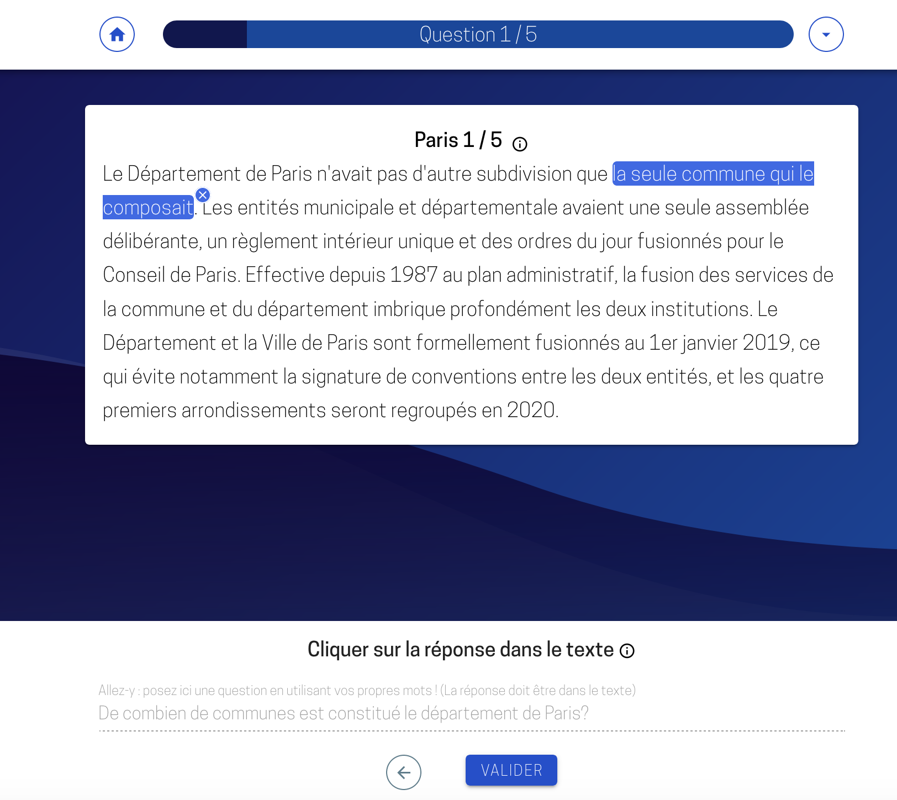

# Mon projet nécessite-t-il une phase d'annotation et quelle stratégie d'annotation adopter ?

Beaucoup de projets réalisés à partir de données non structurées nécessitent une phase d'annotation, le recours à l'annotation n'est pourtant pas systématique. A cette question préalable de la nécessité ou non d'une phase d'annptation, s'ajoute celle de la stratégie d'annotation à adopter: annoter le corpus de données à la main ou automatiser le processus d'annotation ?

## Bien connaître son corpus de données 

Il faut dans un premier temps prendre en compte la nature des données à analyser : 
- Les données sont elles structurées, semi-structurées, non structurées? 
- Est-ce un stock de données historiques qui ne sera pas réalimenté dans le futur ou un flux de données alimenté en continu ? 
- Quel est le volume des données ? 

Les réponses à ces différentes questions seront déterminantes pour les choix à effectuer en termes d'annotation: dois-je annoter ou non ? Quelle stratégie d'annotation adopter ? Nous revenons d'abord sur la différence entre annotation manuelle et annotation automatique, puis nous présenterons les différentes façons d'automatiser l'annotation. 

## Différence entre annotation manuelle et annotation automatique 
L'annotation manuelle est la tâche réalisée par un humain qui consiste à attribuer à un label à un document ou à un sous ensemble d'un document. On parle d'annotation automatique lorsque cette tâche est réalisée par un programme informatique. L'automatisation de l'annotation peut être réalisée par différentes méthodes. On distingue parmi les méthodes les plus courantes que: 
- les moteurs de règles
- les algorithlmes d'apprentissage supervisé qui nécessitent une phase d'annotation au préalable 

Ces méthodes, ainsi que dans quels cas de figures elles sont appropriées, sont détaillés dans la suite de cette partie. 

## Annoter par des règles métier permet dans certaines situations de se passer d'annotation manuelle

L’annotation manuelle est une tâche longue et coûteuse, il est donc important de ne pas se lancer tête baissée dans une phase d'annotation. Le plus souvent, les données structurées sont complexes à analyser et nécessitent une phase d'annotation. Il arrive cependant que des données en apparence non structurées présentent des régularités fortes qui permettent d'automatiser la structuration de l'information qu'elles contiennent et donc de se passer d'annotation. 

On parle alors de structuration de la donnée ou d'annotation par moteur de règles.
 
::: lexique Moteur de règles

Un moteur de règles est un ensemble de règles prédéfinies « à l'avance ». Par exemple, une règle de pseudonymisation pourrait être « si le mot qui suit "Monsieur" ou "Madame" commence par une majuscule, alors ce mot est un prénom ». La complexité du langage naturel et la diversité des formulations qui se trouvent dans les documents fait que ce type de moteur de règles a de forte chance de faire beaucoup d'erreurs dans des textes complexes, ou dont la forme varie souvent. :::

 Concrètement, avec un moteur de règles, le passage de la données structurées à de la données structurée se fait par un programme informatique qui implémente des règles déterministes. Si ce type de méthode fournit des résultats satisfaisants, cette méthode s'avère alors beaucoup moins coûteuse que l'annotation manuelle. Si en revanche, un moteur de règles ne permet pas d'attendre des résultats avec le niveau de précision souhaité, vous devrez probablement avoir recours à de l'annotation manuelle. 

::: Tip Exemple avec des données textuelles: Extraction d'informations à partir de formulaires word: 
Vous disposez d'un ensemble de documents textuels comme des réponses à un questionnaire. Vous cherchez à extraire une certain nombre d'informations de ces documents (nom, prénom, adresse par exemple). Des règles informatiques simples de recherche textuelle (le texte entre "Nom" et "Prénom" permet d'extraire le nom, le texte entre "Prénom" et "Adresse" permet d'extraire le nom) peuvent dans certains cas d'extraire les informations. 
:::

::: Tip Exemple avec des données images : anonymisation des bulletins de salaires scannés
Vous disposez de bulletins de salaire au format image que vous souhaitez anonymiser (par exemple, retirer les données à caractère personnel comme les noms, prénoms, adresses). Il est très probables que tous les bulletins aient le même format et donc que les informations à retirer se retrouvent précisément au même endroit de l'image. Appliquer des règles déterminites du type mettre un carré noir de taille *lxL* aux coordonnées *xy* permet d'éviter de recourir à une annotation manuelle de tous les documents, qui reviendrait à demander à une personne, à l'aide d'un outil d'annotation d'image, d'identifier sur chaque document les endroits où se trouves les informations à caractère personnel. 
:::

## Automatiser l'annotation manuelle à l'aide de l'intelligence artificielle : dans quels cas est-ce pertinent ?

Si le volume des données est relativement limité, il n’est pas nécessairement pertinent d’envisager des méthodes d’IA pour structurer la donnée. Par exemple, vous souhaitez analyser les réponses en texte libre à un questionnaire, afin d’en tirer des conclusions précises sur les thématiques abordées par les répondants. Si le volume des données est faible, une étape d’annotation seule pourra répondre à votre objectif sans être trop couteux en temps. Nous ne donnons pas ici de seuil de nombre de documents permettant de juger de la pertinence ou non de la mise en place de solutions d’IA car l’évaluation du temps nécessaire à l’annotation manuelle du jeu de données dépendra de la nature et de la longueur des documents, ainsi que de la complexité de la tâche d’annotation. 

En revanche, si l’on est confronté à un volume important de documents ou un flux continu, il est en général pertinent d’envisager d’automatiser le processus d’annotation. Dans ce cas, la phase d’annotation aura pour objectif d’annoter une partie des documents (encore une fois, le volume nécessaire de documents annotés dépendra de la nature des documents et de la complexité de la tâche) afin d’entraîner un algorithme supervisé à automatiser cette tâche. 

Pour résumer, voici un schéma du questionnement à suivre pour déterminer si un projet nécessite ou non une phase d'annotation et choisir la bonne stratégie d'annotation. 

*Schéma du questionnement à suivre pour déterminer si un projet nécessite une phase d'annotation*

Ce schéma simplifie une réalité souvent plus complexe, et vous pourrez en pratique être amené à tester différentes méthodes, voire à combiner ces différentes méthodes. Par exemple, un moteur de règles pourra s'avérer insuffisant en termes de performance mais pourra être utile comme aide à l'annotation. On parle alors de pré-annotation (sujet qui sera détaillé dans la partie [Conduire votre campagne d'annotation](3-conduire-campagne-annotation.md)). De plus, la plupart des questions n'ont en général pas de réponses univoques, en particulier: 
 - "Puis-je extraire les informations dont j'ai besoin à l'aide d'un moteur de règles avec une précision suffisante?" : la question du seuil de précision minimale résulte souvent d'un arbitrage avec d'autres variables et en particulier avec les ressources à disposition pour l'annotation 
 - "Ai-je beaucoup de données à annoter ou ai-je un flux continu de données?" Le seuil maximal de données dépendra notamment de la complexité de la tâche d'annotation, des ressources disponibles pour l'annotation manuelle comparées aux ressources pour l'automatisation 

## Annoter ou repenser la façon de collecter la donnée ? 

Le besoin en annotation peut parfois mettre en lumière un mode de collecte de la donnée qui n'est pas adapté aux besoins des utilisateurs. Le travail d'annotation *ex post* aurait parfois pu être évité en intégrant un processus de structuration de la donnée *ex ante*, cette dernière solution permettant un gain de temps souvent significatif par rapport à la première. 

::: tip Par exemple, l'enregistrement dans un système d'information d'une procédure ou d'une déclaration est réalisé via une application permettant à des agents de remplir un certains nombre de champs. Certains champs à remplir en texte libre peuvent ainsi nécessitant une annotation *ex post* afin d'utiliser l'information alors que la même information aurait pu être saisie via un menu déroulant comportant une liste pré-définie de champs pour être directement exploitable. :::

## Exemples de projets d'intelligence artificielle comportant une phase d’annotation  

Les exemples de projets comportant une phase d'annotation sont nombreux. Par exemple plus de la moitié des projets sélectionnés dans le cadres de l'Appel à Manifestation d'Intérêt pour l'intelligence artificielle (AMI IA 1 et 2) ont nécessité une phase d'annotation. Cette partie présente quelques exemples dans le secteur public. 

### PIAF (Pour des IA Francophones)

::: tip Le projet en quelques chiffres : 
- le projet: Annoter des paragraphes wikipedia en rédigeant 5 paires de questions/réponses 
- le temps moyen pour annoter un paragraphe : eniron 5 min par paragraphe
- l'équipe d'annoteurs : équipe de contributeurs volontaires ( 640 contributeurs en septembre 2020)
- le nombre de questions-réponses réalisées en septembre 2020: 8640 
- le schéma synthétique d'annotaton : trouver 5 questions portant sur un paragraphe donné et souligner la réponse correspondante dans le texte du paragraphe ::: 

*Capture d'écran de la plateforme d'annotation Piaf, en bas de l'écran, un exemple d'une question rédigée par un annotateur et de la réponse correspondante que l'annotateur doit souligner dans le texte en haut de l'écran*

[PIAF](https://piaf.etalab.studio/) est un projet porté par le Lab IA d'Etalab qui a pour but de constituer un jeu de données francophone pour entraîner des algorithmes d’intelligence artificielle (IA) de questions-réponses. Ces derniers permettent de trouver des réponses à des questions précises portant sur un ensemble de documents. Construire des algorithmes performants de questions-réponses (question-answering en anglais) compte aujourd’hui parmi les tâches les plus complexes du traitement du langage naturel. Or avant le lancement du projet en 2019, il n'existait pas de jeu de données de ce type en français. Les algorithmes de questions-réponses sont pourtant utiles dans plein de domaines, et les [cas d'usage](https://piaf.etalab.studio/cas-usage/) sont nombreux, on y compte par exemple la création d'agents conversationnels ou l'amélioration de moteurs de recherche. 

La tâche d'annotation consiste ici à annoter des paragraphes de wikipédia. Pour chaque paragraphe, l'annotateur a pour tâche de trouver cinq questions portant sur le paragraphe et y souligner la réponse correpondante. Pour plus d'information, vous pouvez vous référer au [protocole d'annotation](https://piaf.etalab.studio/img/fr_protocol.pdf). Une [plateforme d'annotation](https://app.piaf.etalab.studio/signup/) a été développée est permet à toute personne francophone d'annoter des paragraphes afin d'alimenter le jeu de données. Nous reviendrons plus tard sur la méthode de *crowd sourcing* des annotations. 

 
### La pseudonymisation des décisions de justice à la Cour de Cassation  

::: tip Le projet en quelques chiffres : 
- le volume de documents: 180 000 décisions (bases de données « Jurinet » et « Jurica ») par an, un stock de 3 millions de décisions de justice à diffuser
- le temps moyen pour annoter un document : entre 5 et 10 min par décision 
- l'équipe d'annoteurs : 10 ETP à plein temps
- le schéma synthétique d'annotaton : nom et prénom de personne physique, date de naissance, adresse 
- résultats obtenus : l'algorithme d'IA entraîner arrive à un taux d'erreur moyen de 1% ::: 

La Cour de Cassation est chargée de la diffusion des décisions de justice. Le périmètre de diffision est étendu depuis la publication du décret sur [l'Open Data des décisions de justice](https://www.legifrance.gouv.fr/jo_pdf.do?id=JORFTEXT000042055251). Cette diffusion ne peut cependant se faire qu'après avoir occulté des décisions de justice les éléments àcaractère personnel. Afin de mettre en oeuvre cette occultation, la Cour de Cassation a recours à une équipe d'une dizaine d'annotateurs afin d'identifier dans les décisions les éléments à caractère personnel à (noms, prénoms, adresses, dates de naissance) retirer avant diffusion. Afin d'automatiser ce processus, la cour de cassation à des data scientists via le programme [Entrepreneurs d'Intérêt Général](https://entrepreneur-interet-general.etalab.gouv.fr/index.html) pour développer une solution d'Intelligence Artificielle de pseudonymisation des décisions : c'est le projet  [Open Justice](https://entrepreneur-interet-general.etalab.gouv.fr/defis/2019/openjustice.html). Cette solution est basée sur un algorithme entraîné à partir d'un corpus de décisions annotées par des annotateurs. Afin d'optimiser le processus d'annotation, la Cour de cassation va développer un logiciel d'annotation via le projet [Label](https://entrepreneur-interet-general.etalab.gouv.fr/defis/2020/label.html).

Pour plus d'information sur la pseudonymisation de documents textuels à l'aide de méthodes d'intelligence artificielle, vous pouvez consulter notre [guide pseudonymisation](https://guides.etalab.gouv.fr/pseudonymisation/#a-quoi-sert-ce-guide). 

### Projet DDTM Hérault : annotation d'images satellites 

::: tip Le projet en quelques chiffres : 
- le projet: Développer un outil d'intelligence artificielle  qui repère automatiquement les constructions illégales 
- l'équipe d'annoteurs : 4 agents sur une période de 4 semaines, à raison d'1 à 2 heures par jour
- volume de documents annotés: 6 000 images 
- le schéma synthétique d'annotaton : caravane, mobiles homes, construction en dur, construction légère, piscine, décharge, déchets industriels, navires ::: 

*Une capture d'écran du logiciel d'annotation développé pour la DDTM de l'Hérault*

Ce projet, réalisé dans le cadre de la première saison de l'[Appel à Manifestation d'Intérêt en Intelligence Artificielle](https://www.etalab.gouv.fr/intelligence-artificielle-decouvrez-les-6-projets-laureats-de-lappel-a-manifestation-dinteret-ia) à la [DDTM de l'Hérault](http://www.herault.gouv.fr/Services-de-l-Etat/Agriculture-environnement-amenagement-et-logement/Direction-Departementale-des-Territoires-et-de-la-Mer-de-l-Herault-DDTM-34) , vise a développer un modèle d’analyse d’images aériennes ou satellites pour automatiser le pré-repérage des infractions potentielles liées à la cabanisation. Cette automatisation nécessite une phase d'annotation manuelle d'images satellites. La tâche d'annotation consiste à repérer sur l'image les zones correspondant à plusieurs types d'objet types d’objets (caravanes, mobile homes, constructions en dur, piscines, navires) et à leur attribuer le label correspondant. Un logiciel d'annotation d'image a été développé à cet effet. 

