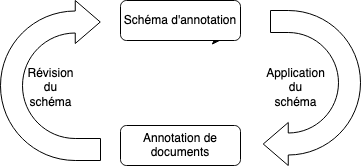

# Organiser votre campagne d'annotation 

Nous avons présenté dans la partie précédente les différentes stratégies d'annotation possibles. Nous décrivons dans cette partie le travail préparatoire à la campagne d'annotation, particulièrement important pour réussir une campagne d'annotation. Les recommandations données ici ne seront pas nécessairement toutes pertinentes pour tous les projets, chaque projet comportant ses spécificités. 

## Identification de l'équipe projet 

Mener à bien un projet d'annotation nécessite la mobilisation d'une équipe dont les membres remplissent des fonctions bien précises. En plus des personnes en charge de réaliser les annotations (on parlera d'annotateurs), un profil ayant des connaissances métier (chef de projet) ainsi qu'un profil technique (data scientist) seront nécessaires. 

### Un chef de projet : l'expert métier 
Un chef de projet disposant des connaissances métier sera nécessaire. Ses attributions seront de : 
- Etablir le schéma d'annotation (conjointement avec les autres parties prenantes du projet)
- Former les annotateurs (plus de détail dans la partie [Conduire votre campagne d'annotation](3-conduire-campagne-annotation.md), au paragraphe **Etape 3: Former et mobiliser les annotateurs**)
- Estimer le temps moyen pour annoter un document afin de mesurer la charge de travail nécessaire 
- Etablir un plan d'annotation prévisionnel définissant le nombre moyen de documents à annoter par annotateurs et par jour 
- Suivre l'avancement des annotations 
- S'assurer de la qualité des annotations

En fonction de la complexité du projet, le chef de projet pourra faire appel à d'autres experts métier. 

### Le data scientist : l'expert technique 
Un profil de type data scientist permettra, en complément du suivi qualitatif assuré par l'expert métier, de mettre en oeuvre un suivi de l'avancement et de la qualité par des méthodes de data science (plus de détails sur les métriques de qualité dans la suite). L'avantage de ce type de suivi est d'être généralisable à un grand nombre de documents annotés sans nécessiter de coût humain supplémentaire. Par opposition, le suivi qualitatif de l'expert métier permettra de prendre en compte les cas particuliers et les spécificités métier mais le temps nécessaire au suivi sera proportionnel au nombre de documents vérifiés. Les deux types de suivi sont donc complémentaires. 

Le data scientist pourra également mettre en oeuvre des méthodes informatiques ou de machine learning afin de pré-annoter les documents et permettre d'accélérer le processus d'annotation (plus de détails à ce sujet dans la partie [Conduire votre campagne d'annotation](3-conduire-campagne-annotation.md), au paragraphele paragraphe **Etape 6 : Accéler le processus d'annotation**).
 
Les attributions du profil de type data scientist sont de : 
- S'assurer la qualité des annotations (par des tests de cohérence sur les données annotées) 
- Pré-annotater les documents 
- Prioriser les documents à annoter (par des méthodes d'échantillonnage à définir en fonction de différents critères à déterminer avec le métier)
- Si nécessaire, analyse et traitements des documents annotés afin de visualiser différentes métriques et/ou intégrer les documents annotés à la solution d'Intelligence Artificielle 

### L'administrateur de la plateforme d'annotation (expert SI)
Ce rôle sera plus ou moins nécessaire en fonction du logiciel d'annotation retenu et pourra être assuré par le data scientist. Les attributions de l'administrateur de la plateforme d'annotation sont de : 
- S'assurer de l'installation du logiciel, de la création de comptes utilisateurs pour les différents annotateurs 
- Charger les documents à annoter sur la plateforme
- S'assurer du stockage des annotations
Ce dernier aspect est particulièrement important. Le travail d'annotation est coûteux en temps, il est donc primordial de veiller à un avoir des sauvegardes régulières afin de ne pas perdre le travail des annotateurs. 

### Les annotateurs 
Le profil des annotateurs dépend du type de tâche d'annotation à effectuer. Certaines tâches nécessitent seulement la maîtrise de la langue française (identifier les noms et prénoms de personnes physiques dans un texte par exemple) et ne font pas appel à d'autres connaissances spécifiques. D'autres tâches nécessitent en revanche un certain niveau d'expertise et il faudra veiller à recruter les bons profils d'annotateurs. 

L'annotateur a pour attributions de : 
- Comprendre la tâche (le temps nécessaire à la montée en compétence ne doit pas être négligé)
- Annoter les documents
- Faire remonter des questions, des difficultés au fil de l'annotation au chef de projet

## Définir la problématique 

L'annotation est généralement une étape liminaire d'un projet ayant une finalité plus large. Une réflexion globale sur la problématique du projet est  indispensable avant le démarrage effectif de la phase d'annotation, afin que les annotations réalisées permettent de répondre de manière efficace à la problématique. Le travail d'annotation pourrait être différent selon l'application visée et la problématique choisie. Il est donc important de répondre à un certain nombre de questions:

- A quel problème répond le projet ? 
-  Quel est le contexte du projet ?  A quelle mission de service public contribue le projet ? A quel problème doit répondre le projet ? Des solutions pour répondre à ce problème sont-elles déjà en place ? Si oui quelles sont leurs limites ou leurs défauts ? 
- Quels sont les objectifs stratégiques du projet ? A quel objectif de mon organisation répond le projet (intérêt général, amélioration de la qualité d'un service, etc.) ?
- Quels objectifs opérationnels du projet ?
- Quels sont les impacts attendus de la solution dans l'organisation du service (du point de vue des agents publics et/ou des utilisateurs du service) ? 
- Existe-t-il des projets similaires desquels je gagnerais à prendre connaissance ? Bien que chaque projet ait ses spécificités, il peut être utile de se renseigner sur d'autres projets ayant une problématique similaire. Parmi les grandes problématiques en traitement du langage naturel, on trouve la classification de documents (par exemple, déterminer si un e-mail est un spam ou non), l'extraction d'informations (par exemple, identifier les moyens et la conclusion dans un décision de justice), la priorisation de documents à traiter (par exemple, attribuer un note de gravité à des signalements d'événements sanitaires), corriger des erreurs de saisies dans un formulaires (par exemple, le projet AMI IA de la DGCL), détecter des éléments manquants dans un texte (par exemple, projet AMI IA pour la DGGN de détecter les éléments manquants dans un plainte déposée en ligne). 
- Quel est le périmètre de la solution ? Cette question aura en général un impact direct sur le périmètre des données à annoter, elle est donc très importante. Le périmètre peut être géographique, fonctionnel, etc.

## Elaborer le schéma d'annotation 

Le schéma d'annotation est un modèle qui permet de décrire les annotations de votre projet. Il doit découler de la problématique définie précédemment. Concrètement, il est constitué a minima d'un ensemble d'étiquettes (c'est-à-dire des termes permettant de caractériser telle ou telle information dans un document) et d'une définition précise de ces différentes étiquettes. Pour certains projets, le schéma d'annotation peut en plus être défini par une hiérarchisation entre les étiquettes ou encore par des relations entre les termes. L'ensemble des étiquettes peuvent en effet être hiérarchisées entre elles (par exemple, un schéma peut se décliner en thèmes et sous-thèmes, où à chaque thème correspond une liste spécifique de sous-thèmes) ou être reliés entre eux (par exemple, une tâche d'annotation pourra être de relier un pronom au nom auquel il se rapporte). 

La problématique métier à laquelle le projet répond est souvent complexe, avec beaucoup de cas particuliers ou d'exceptions aux règles usuelles. Etablir un schéma d'annotation implique souvent un travail de simplification (qui a également pour conséquence une perte d'information ou de précision).  Il est important cependant ne pas simplifier à l'extrême, et donc de trouver un bon équilibre entre simplicité et adéquation à la problématique métier. Afin de trouver cet équilibre, un processus itératif est généralement la meilleure méthode à adopter. Si l'annotation a pour objectif d'entraîner un algorithme d'intelligence artificielle, il ne faut pas exclure a priori des spécificités ou des consignes qui seraient trop difficiles à reproduire par une solution automatique. 

::: tip Exemple du choix des catégories pour pseudonymiser les décisions de justice: afin de limiter au maximum le risque de réidentification, il faut se demander quelles informations doivent être retirées et comment les catégoriser. Un nombre restreint de catégories (nom, prénom, adresse, date de naissance par exemple) aura pour avantage des consignes d'annotations plus simples, alors qu'une catégorisation plus fine (personnes physiques, personnes morales, adresse complète, lieu de résidence par exemple) permettra de mieux cibler certaines informations sensibles. :::

Il est important d'évaluer la clarté du schéma d'annotation et des consignes pour l'implémenter et de la reproductibilité des tâches d'annotation entre différents annotateurs. En effet des consignes d'annotation peu claires ou intéreprétables de façon différente par différents annotateurs auront pour conséquences : 
- De rendre inopérable l'évaluation de la qualité des annotations 
- De compromettre l'automatisation de la tâche par un algorithme d'intelligence artificielle 

::: tip Exemple: Analyse de l'ironie dans des tweet.  Des interprétations différentes du langage, des prises en compte différentes du contexte peuvent amener deux personnes différentes à percevoir caractériser différemment le caractère ironique ou non d'un tweet. [Ce papier](https://hal.archives-ouvertes.fr/hal-01429673/document) de chercheurs en traitement automatique du langage présente un schéma d'annotation élaboré pour analyser l'ironie dans les tweets. :::

### Le cycle schéma / annotations

Elaborer un schéma d'annotation nécessite de prendre en compte à la fois la problématique du projet et les caractéristiques des documents à annoter. Ainsi élaborer un premier schéma d'annotation répondant à la problématique, le tester en annotant des documents puis le réviser au fur et à mesure de l'annotation. C'est en général en annotant que l'on s'aperçoit si le schéma d'annotation est adapté ou non aux documents. 

::: tip Par exemple, pour un projet d'annotation de réponses à un questionnaire en texte libre, on peut avoir une idée a priori des thématiques abordées, ce qui permet d'élaborer une première version du schéma d'annotation, mais l'annotation des réponses pourra faire émerger de nouvelles thématiques qui pourront venir compléter le schéma d'annotation. :::

## Développer la documentation et la mettre à jour 

Votre documentation est essentielle est doit évoluer tout au long de votre campagne. En gardant une trace de la démarche adoptée et en recensant les difficultés rencontrées, la documentation est très utile pour que tous les membres de l'équipe projet partagent le même niveau d'information et peut également bénéficier à d'autres projets similaires. 

Plusieurs types de documentations s'adressant à différentes fonctions dans le projet sont utiles : une documentation générale, une documentation pour les annotateurs et une documentation pour l'administrateur de la plateforme d'annotation. 

### Une Documentation générale 
Une documentation générale décrivant le contexte et les objectifs du projet, expliquant pourquoi l'annotation est nécessaire est utile. Cette documentation s'adresse à toute personne qui souhaite comprendre le projet (directeur, grand public si le projet est open source). Il est également important de documenter le cheminement intellectuel menant au schéma d'annotation et les différentes itérations s'il y en a eu. 

### Un guide à destination des annotateurs 
Cette documentation est notamment le support de formation des annotateurs, elle est donc très importante, et donc inclure notamment : 
- La description du projet, qui permet de donner aux annotateurs une vision claire de l'application visée
- Le schéma synthétique d'annotation (c'est-à-dire la liste des labels du schéma d'annotation, hiérarchisés le cas échéant)
- L'explication des différents labels : définitions précises qui gagnent à être complétées par l'explication des choix méthodologiques effectués et de la logique de l'annotation visée 
- S'il existe des relations à annoter entre les termes, explications et exemples pour chacune des relations 
- Liste des cas particuliers ou des cas susceptibles de poser des difficultés, accompagnée d'exemples concrets (ne pas hésiter à 
faire des captures d'écran du logiciel d'annotation). Cette partie peut prendre la forme d'une rubrique de Questions / Réponses. 
- Documentation pour le logiciel d'annotation (comment se connecter, accéder aux documents à annoter, enregistrer un document 
annoté finalisé, etc.)

### Un guide à destination de l'administrateur de la plateforme d'annotation 

Il est également important de documenter le fonctionnement de la plateforme d'annotation et de constituer un guide à destination de l'administrateur de la plateforme d'annotation. Ce guide pourra expliquer : 
- Comment créer des comptes aux annotateurs
- Comment charger des documents sur la plateforme 
- Comment attribuer des documents aux annotateurs 
- Comment suivre l'avancement des annotations 
- Comment corriger les annotations 
- Comment exporter les documents annotés 

