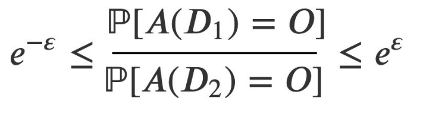

# Mécanismes

_Dans ce ci qui suit, appellons "base transformée" la base de données sur laquelle on a effectué un certain nombre d'opérations pour tenter de la rendre anonymisée. Les exemples traiteront de bases de données personnelles, mais les mécanismes décrits peuvent également servir à anonymiser des données non personnelles, si un cas d'usage s'y prête._

## K-anonymisation (en anglais : _K-anonymity_)

_On appelle quasi-identifiants les champs qui, considérés isolément, ne suffisent pas à identifier un unique individu avec certitude (contrairement à un numéro de pièce d'identité, par exemple), mais dont la combinaison permet de retrouver une identité sans ambiguïté. Ainsi, le nom, le prénom, le sexe, le code postal, la date de naissance, entre autres, sont des quasi-identifiants, car la combinaison de ces champs suffit généralement à identifier une unique personne._

La K-anonymisation se propose de "cacher les individus dans la foule". Pour ce faire, l'algorithme supprime ou regroupe les valeurs de suffisamment de quasi-identifiants afin que, pour chaque combinaison de quasi-identifiants publiés, il y ait au moins K individus possibles.

Plus K est grand, meilleure est la confidentialité de la base. Mais atteindre un K plus grand nécessite de supprimer ou d'altérer davantage d'informations. On peut notamment recourir à plusieurs des méthodes suivantes :
- regrouper des valeurs de quasi-identifiants. Par exemple :
    * remplacer les codes postaux par des aires géographiques plus vastes
    * remplacer les âges par des tranches d'âges
- supprimer des colonnes entières de quasi-identifiants (notamment les informations dont la publication en ligne est proscrite, comme l'orientation sexuelle, les appartenances religieuses ou politiques, etc.)
- supprimer des lignes, dans le cas d'individus "exceptionnels" dont les quasi-identifiants sont trop rares pour respecter le critère de K-anonymisation 

:warning: L'objectif de la K-anonymisation est d'empêcher l'individualisation des personnes dans la base anonymisée. Elle ne garantit pas pour autant que les critères de non-corrélation et de non-inférence seront respectés.

:warning: Remarque théorique : le problème de K-anonymisation optimal (celui qui supprime le strict minimum d'informations) est NP-difficile. Toutefois, et heureusement, des algorithmes donnent des bonnes approximations de la solution optimale.

Limites de la K-anonymisation :
- plus il y a de champs de quasi-identifiants publiés, plus la K-anonymisation est difficile à atteindre. Pour des bases de données de haute dimension, la K-anonymisaiton n'est pas adaptée.
- la K-anonymisation n'empêche pas l'inférence de données sensibles

Attaques contre la k-anonymisation : 
- 

## La L-diversité

Le but de la L-diversité est de restreindre autant que possible le risque qu'on puisse inférer une information sensible sur un individu de la base transformée.

Pour ce faire, on doit faire en sorte que pour chaque combinaison de quasi-identifiants, 

## Confidentialité différentielle

L'anonymisation est dynamique : on anonymise à chaque requête plutôt qu'une fois pour toutes. L'anonymisation repose sur l'ajout de bruit sur les champs renvoyés au requêteur.

On mesure le _privacy budget_ avec ε, défini à la page [Mesures](3-mesures.md)

### La confidentialité différentielle

La confidentialité différentielle repose sur l'ajout de bruit aléatoire sur les données renvoyées à l'utilisateur de données transformées (c'est le principe du "floutage"). Ce processus de bruitage est calculé dynamiquement à chaque requête à la base de données.

Toute la difficulté est d'arbitrer correctement le niveau de bruit à ajouter aux données, pour garantir la confidentialité des données sous-jacentes tout en s'efforçant de ne pas brouiller les données dans des proportions qui les rendraient inutilisables. 

Imaginons qu'un individu mal intentionné fasse deux requêtes successives qui ne varient que d'un individu, dans l'intention d'inférer des informations sensibles sur cet individu. Il est nécecessaire de bruiter (randomiser) suffisamment les sorties pour qu'on ne puisse pas remonter trop sûrement aux caractéristiques du nouvel individu. 

De nombreux mécanismes permettent de bruiter les données d'une personne tout en permettant de retrouver les statistiques globales qui nous intéressent ([exemple issu de Wikipedia d'une méthode issue des sciences sociales](https://fr.wikipedia.org/wiki/Confidentialit%C3%A9_diff%C3%A9rentielle#Illustration)). Pour mesurer le niveau de confidentialité induite par un processus de bruit 

La mesure de la privacy peut être faite avec la differential privacy :

Soit ε > 0 et A un algorithme de randomisation qui prend en entrée une base de données et génère une base de données anonymisée. Notons Image(A) l'ensemble des bases de données anonymisées qui pourraient être générées par A (et qui contient donc l'ensemble des bases de données anonymisées qu'on pourrait être amené à publier)

L'algorithme A est dit ε-différentiel si, pour toute base de données  D1 et D2 qui ne diffèrent que d'une seule personne, et pour toute base dérivée O dans Image(A) :

Autrement dit, on veut contrôler le "shift" provoqué par l'ajout d'un individu, même exceptionnel, à la base de données. Si ε est proche de 0, les statistiques sur D1 et D2 seront proches, ce qui garantit une bonne confidentialité aux données de la base transformée. Inversement, si ε est grand, 

Parfois la caractérisation d'un seul individu, exceptionnel, peut affecter statistiquement l'ensemble de la transformation, si bien qu'on peut revenir à la caractéristique initiale de l'individu.
Ainsi, si on publie plusieurs bases anonymisées, le shift de la deuxième base permet de revenir aux caractéristiques du nouvel entrant.

Exemple d'une mesure de confidentialité différentielle d'un mécanisme souvent utilisée en sciences sociales : [lien wikipédia](https://fr.wikipedia.org/wiki/Confidentialit%C3%A9_diff%C3%A9rentielle#Illustration)

Limites :
- les résulats de chaque requête est légèrement bruitée, pour empêcher qu'un adversaire mal intentionné sache exactement quelles étaient les valeurs initiales dans la base à de donnée. Mais à chaque requête supplémentaire, l'adversaire diminue le doute qu'il a sur les valeurs initiales... si bien qu'il peut estimer de plus en plus finement les paramètres initiaux de la base de données. Il faut donc prévenir cette stragégie, en limitant le nombre de requêtes qu'un adversaire pourra faire sur la base de données (notion de _query budget_). 

## Méthodes adverses

Sans approfondir le sujet des méthodes adverses, notons que le mécanisme des méthodes adverses (comme les _Generative Adversarial Network (GAN)_, conditionnels ou pas, et les _Auto-Encoders (AE)_) constitue une piste intéressante, mais très complexe (surtout si l'on veut réunir les trois critères d'anonymisation), pour générer des données synthétiques vérifiant certaines caractéristiques statistiques intéressantes des données initiales mais néanmoins suffisamment éloignées d'elles pour empêcher une fuite de données personnelles.

Toutefois, nous n'avons aucune solution générique, et encore moins clef-en-main, à recommander dans cette direction.