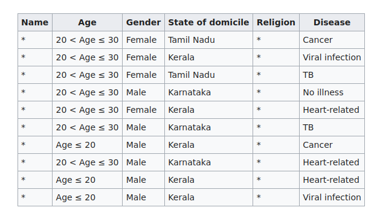
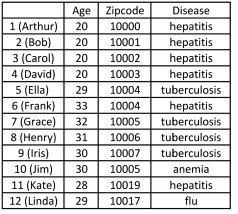
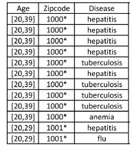

# Mécanismes

_Dans ce qui suit, appellons "base transformée" la base de données sur laquelle on a effectué un certain nombre d'opérations afin de l'anonymiser. Les exemples traiteront de bases de données personnelles, mais les mécanismes décrits peuvent également être adaptés, le cas échéant, pour des cas d'usage de confidentialité au-delà ._

## K-anonymisation (en anglais : _K-anonymity_)

Parmi les champs de données personnelles identifiantes, on distinguera les champs qui, considérés isolément, sont suffisants pour identifier un individu sans doute possible (par exemple : un numéro de sécurité sociale, des données biométriques, etc.), et les champs <b>quasi-identifiants</b> qui, isolément, ne suffisent pas à l'identification, mais dont la combinaison permet d'identifier les individus. Ainsi, le nom, le prénom, le sexe, le code postal, la date de naissance, entre autres, sont des quasi-identifiants, car la combinaison de ces champs suffit généralement à identifier une unique personne.

### Principe

La méthode de K-anonymisation (où K désigne un nombre entier positif) se propose de "cacher les individus dans la foule". Pour ce faire, l'algorithme supprime ou regroupe les valeurs de suffisamment de quasi-identifiants afin que, pour chaque combinaison de quasi-identifiants publiés, il y ait au moins K individus possibles.

Plus K est grand, meilleure est la confidentialité de la base. Mais atteindre un K plus grand nécessite de supprimer ou d'altérer davantage d'informations. On peut notamment combiner les méthodes suivantes:
- regrouper des valeurs de quasi-identifiants. Par exemple :
    * remplacer les codes postaux par des aires géographiques plus vastes
    * remplacer les âges par des tranches d'âges
- supprimer des colonnes entières de quasi-identifiants (notamment les informations dont la communication à un tiers, et a fortori la publication, est proscrite, comme l'orientation sexuelle, les appartenances religieuses ou politiques, etc.)
- supprimer des lignes, dans le cas d'individus "exceptionnels" dont les quasi-identifiants sont trop rares pour respecter le critère de K-anonymisation.

#### Exemple

Ci-dessous un exemple factice, issu de Wikipedia, de 2-anonymisation d'une table de patients imaginaires d'un hôpital en Inde.

Donnée initiale (qui contient également des informations religieuses dont la publication est proscrite) :

Donnée 2-anonymisée :

:warning: L'objectif de la K-anonymisation est d'empêcher l'individualisation des personnes dans la base anonymisée. Elle ne garantit pas pour autant que les critères de non-corrélation et de non-inférence seront respectés.

### Heurisitiques

Le problème peut se traiter sous plusieurs angles, et notamment avec des méthodes de clustering garantissant au moins K membres par cluster. Ce problème est alors NP-complet mais il existe des complexités quadratiques en le nombre d'entrées à anonymiser

### Limites de la K-anonymisation :
- plus il y a de champs de quasi-identifiants publiés, plus la K-anonymisation est difficile à atteindre. Pour des bases de données de haute dimension, la K-anonymisation n'est pas adaptée.
- la K-anonymisation n'empêche pas l'inférence de données sensibles. Par exemple, dans le cas où les K personnes anonymisées avec les mêmes quasi-identifiants partagent toutes la même caractéristique sensible, on déduit beaucoup d'information sensible (pour faire une analogie : si tous les électeurs d'une commune votent pour le même candidat, le secret du vote est éventé). Et même dans des cas moins extrêmes, dès lors qu'il y a peu de variété dans les valeurs des champs sensibles, on peut déduire beaucoup de chose sur les indivus.

:warning: Remarque théorique : le problème de K-anonymisation optimal (celui qui supprime le strict minimum d'informations) est NP-difficile. Toutefois, et heureusement, des algorithmes donnent des bonnes approximations de la solution optimale.

## La L-diversité

_On appelle champs sensibles les champs de données donnant des informations sensibles sur les personnes (données de santé, adresse, informations financières, etc.). L'on veut empêcher qu'une personne malveillante ne puisse déduire des informations sensibles sur une personne en combinant la base anonymisée à des informations extérieures_

### Principe

Le but de la L-diversité (où L est un entier > 0) est de limiter autant que possible le risque décrit dans le paraphe ci-dessus, à savoir que l'on puisse inférer une information sensible sur un individu de la base transformée.

Pour ce faire, on doit faire en sorte que pour chaque combinaison de quasi-identifiants, il y ait au moins L valeurs possibles. Pour reprendre l'analogie factice du vote, si L = 4, on ne publie pas de registres de participation électorale dans les bureaux de vote où il y a moins de 4 candidats qui ont recueilli au moins un suffrage.

### Exemple

Donnée initiale :

Donnée 2-diverse (pour chaque combinaison de champs quasi-identifiants, il y a deux maladies candidates possibles):

### Heurisitiques

dfkgjtd

### Limites de L-diversité

- La L-diversité ne procure ni une condition suffisante ni une condition nécessaire à la protection des données personnelles
- Si les valeurs des informations sensibles sont sémantiquement proches les unes des autres, on peut obtenir des informations sensibles. Par exemple, une classe dont les valeurs possibles pour le champ maladie serait "cancer de la peau", "cancer du sein", et "cancer du poumon" serait 3-diverse, mais dévoilerait l'information que tous les membres de la classe ont un cancer.
- Garantir que L individus partagent la même caractéristique sensible n'empêche pas toujours d'inférer l'information sensible, il faut également prendre en compte la distribution des différentes valeurs des champs sensibles : si sur un village de 100 habitants, 96% ont voté pour le même candidat, et 1% pour quatre autres candidats, on peut avoir une table 5-diverse et néanmoins faire des inférences assez vraisemblables sur le vote de chaque citoyen pris isolément.

## La L-proximité

A compléter

### Principe

### Exemple

### Heuristiques

fkhgfkhkj
