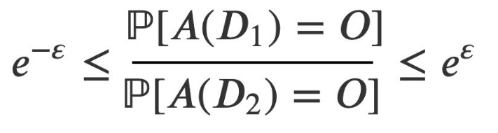

## La confidentialité différentielle

La confidentialité différentielle repose sur l'ajout de bruit aléatoire sur les données renvoyées à l'utilisateur de données transformées (c'est le principe du "floutage"). Ce processus de bruitage est calculé dynamiquement à chaque requête à la base de données.

Toute la difficulté est d'arbitrer correctement le niveau de bruit à ajouter aux données, pour garantir la confidentialité des données sous-jacentes tout en s'efforçant de ne pas brouiller les données dans des proportions qui les rendraient inutilisables. 

Imaginons qu'un individu mal intentionné fasse deux requêtes successives qui ne varient que d'un individu, dans l'intention d'inférer des informations sensibles sur cet individu. Il est nécecessaire de bruiter (randomiser) suffisamment les sorties pour qu'on ne puisse pas remonter trop sûrement aux caractéristiques du nouvel individu. 

De nombreux mécanismes permettent de bruiter les données d'une personne tout en permettant de retrouver les statistiques globales qui nous intéressent ([exemple issu de Wikipedia d'une méthode issue des sciences sociales](https://fr.wikipedia.org/wiki/Confidentialit%C3%A9_diff%C3%A9rentielle#Illustration)). Pour mesurer le niveau de confidentialité induite par un processus de bruit 

La mesure de la privacy peut être faite avec la differential privacy :

Soit ε > 0 et A un algorithme de randomisation qui prend en entrée une base de données et génère une base de données anonymisée. Notons Image(A) l'ensemble des bases de données anonymisées qui pourraient être générées par A (et qui contient donc l'ensemble des bases de données anonymisées qu'on pourrait être amené à publier)

L'algorithme A est dit ε-différentiel si, pour toute base de données  D1 et D2 qui ne diffèrent que d'une seule personne, et pour toute base dérivée O dans Image(A) :

_ε est le privacy budget_

Autrement dit, on veut contrôler le "shift" provoqué par l'ajout d'un individu, même exceptionnel, à la base de données. Si ε est proche de 0, les statistiques sur D1 et D2 seront proches, ce qui garantit une bonne confidentialité aux données de la base transformée. Inversement, si ε est grand, 

Parfois la caractérisation d'un seul individu, exceptionnel, peut affecter statistiquement l'ensemble de la transformation, si bien qu'on peut revenir à la caractéristique initiale de l'individu.
Ainsi, si on publie plusieurs bases anonymisées, le shift de la deuxième base permet de revenir aux caractéristiques du nouvel entrant.

Exemple d'une mesure de confidentialité différentielle d'un mécanisme souvent utilisée en sciences sociales : [lien wikipédia](https://fr.wikipedia.org/wiki/Confidentialit%C3%A9_diff%C3%A9rentielle#Illustration)

### Limites :
- les résulats de chaque requête sont légèrement bruités, pour empêcher qu'un adversaire mal intentionné ne sache exactement quelles étaient les valeurs initiales dans la base à de donnée. Mais à chaque requête supplémentaire, l'adversaire diminue le doute qu'il a sur les valeurs initiales... si bien qu'il peut estimer de plus en plus finement les paramètres initiaux de la base de données. Il faut donc prévenir cette stragégie, en limitant le nombre de requêtes qu'un adversaire pourra faire sur la base de données (notion de _query budget_ - à développer). 
