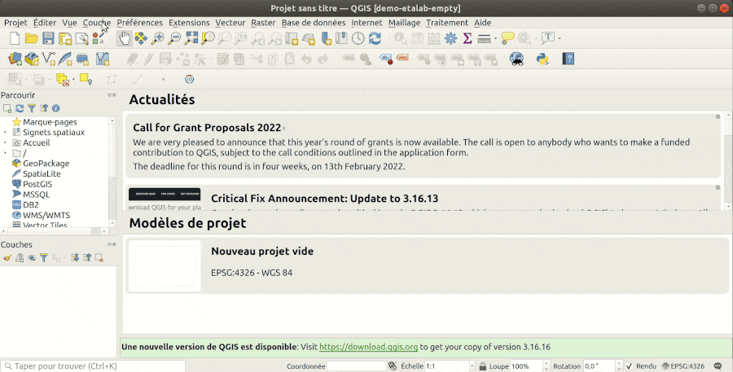

# API découpage administratif

## Les usages

Il existe plusieurs usages lorsqu'on veut les données administratives françaises. On peut selon le cas, vouloir les infos
- à des échelles différentes (communes, départements, régions),
- des années différentes (notion de millésime)

La manière de consommer la donnée peut varier. On peut avoir besoin de plusieurs communes, de rechercher dans un formulaire. L'API Découpage Administratif est principalement destinée à un besoin de recherches pour des formulaires en partant du nom de la commune, du code postal ou bien du code INSEE. Les usages départements ou régions bien que pratiquent semblent moins intéressant car les données ne changent quasiment jamais dans le temps et le nombre limités d'éléments fait qu'il est possible de gérer ces informations côté client.

## Utilisation de l'API dans un site web

Faire de l'auto-complétion depuis l'API soit pour remplir un formulaire, soit pour zoomer sur la commune trouvée dans un contexte web

- <http://bl.ocks.org/ThomasG77/0b99013795f76699c5c9a0d7daf4411e>

La partie importante se base sur un simple [Fetch](https://developer.mozilla.org/fr/docs/Web/API/Fetch_API)


Il est aussi possible de remplir les informations de coordonnées dans un tableur comme Libre Office <https://medium.com/@ThomasG77/api-et-g%C3%A9ocodage-dans-libre-office-calc-488ab78dc360>

## Rappels des exemples officiels

Pour des usages plus spécifiques, vous pouvez utiliser [les exemples de la documentation officielle](https://geo.api.gouv.fr/decoupage-administratif)

On peut reprendre les plus notables ici.

### Par communes

- Recherche par code postal <https://geo.api.gouv.fr/communes?codePostal=78000>
- Recherche par code INSEE <https://geo.api.gouv.fr/communes?code=44109>
- Recherche par nom <https://geo.api.gouv.fr/communes?nom=Nantes&boost=population&limit=5> (on ajoute un boost par population pour que la plus grand commune soit privilégiée)
- Par coordonnées <https://geo.api.gouv.fr/communes?lat=47.0482944&lon=-1.1501568>
- Filtrer par département pour éviter les problèmes liés à l'homonymie de commune, par exemple la commune de Saint-Aubin existe dans les départements 10, 21, 36, 39, 40, 47, 59, 62, 91 et 02 <https://geo.api.gouv.fr/communes?nom=Saint-Aubin&codeDepartement=21>
- Obtenir toutes les communes d'un département <https://geo.api.gouv.fr/departements/44/communes>
- Obtenir toutes les communes d'une région <https://geo.api.gouv.fr/communes?codeRegion=84>

Tous les exemples ci-dessus ne filtrent pas les champs, ne permettent pas de choisir si on veut des géométries pour les communes: soit le centre, au sens mathématique, de la commune, soit son contour, ni ne permettent pas le choix de la sérialisation: pour la cartographie, généralement, on utilise un JSON spécifique dit GeoJSON pour cela. La meilleure manière de comprendre comment cela fonctionne est d'utiliser la démo recherche avancée de la documentation officielle https://geo.api.gouv.fr/decoupage-administratif/communes#advanced Elle permet en cochant de voir comment l'URL d'appel change en particulier l'option `fields` pour ne retourner que les colonnes/champs nécessaires.

**Ce qu'il faut retenir pour les aspects géo,**

- si on veut les GeoJSON avec le centre de la commune, rajouter aux urls de la première partie `&format=geojson&geometry=centre` si votre URL contient déjà un `?` sinon il faut ajouter plutôt `?format=geojson&geometry=centre`
- si on veut les GeoJSON avec le contour de la commune, rajouter aux urls de la première partie `&format=geojson&geometry=contour` si votre URL contient déjà un `?` sinon il faut ajouter plutôt `?format=geojson&geometry=contour`

Un exemple pour illustrer

<https://geo.api.gouv.fr/communes?lat=47.0482944&lon=-1.1501568>

devient soit

- centre <https://geo.api.gouv.fr/communes?lat=47.0482944&lon=-1.1501568&format=geojson&geometry=centre>
- contour <https://geo.api.gouv.fr/communes?lat=47.0482944&lon=-1.1501568&format=geojson&geometry=contour>
Il faut aussi penser à mettre en cache quand on a des appels lourds qui ne changent pas ou qu'on retourne des contours. Ainsi, on a :

Sans contour, la réponse fait 480Ko <https://geo.api.gouv.fr/communes?codeRegion=84>
Avec contour, la réponse fait 34Mo <https://geo.api.gouv.fr/communes?codeRegion=84&format=geojson&geometry=contour>

Vous pouvez très bien sauvegarder dans un fichier le résultat des URLs ci-dessus car le résultat ne va pas changer en permanence car ce n'est pas de l'autocomplétion.

### Par régions et départements

Le principal intérêt est la correspondance entre un nom et un code. Si on veut le code d'un département ou d'une région, on prend:

- pour la région <https://geo.api.gouv.fr/regions?nom=Auvergne>
- pour le département <https://geo.api.gouv.fr/departements?nom=Loire%20Atl>

Nous ne détaillons pas plus les cas départements et régions car ils fonctionnent comme les communes mais surtout ils ne changent presque pas. Il est souvent envisageable d'avoir les fichiers globaux JSON plutôt que passer par des appels API. On a ainsi sous forme JSON (sans géométrie):

- les départements <https://unpkg.com/@etalab/decoupage-administratif/data/departements.json>
- les régions <https://unpkg.com/@etalab/decoupage-administratif/data/regions.json>

## Les sources alternatives pour les communes

### Look4 de l'IGN

Pour l'autocompletion, il est possible de passer par l'API de l'IGN dite Look4. Elle ne parait pas correspondre à un besoin communal générique car on peut filtrer les résultats de recherche par type mais une on ne peut pas cumuler les filtres. Il s'avère qu'une commune simple à une `nature` à `Commune` mais que pour une commune qui est une préfecture de région la `nature` est `Préfecture de région`. On a aussi `Préfecture`, `Sous-préfecture`, `Capitale d'état`.

**Exemples**

Recherche avec le texte commençant par `nan` (méthode `prefix`) et filtrage par `Commune`

<https://wxs.ign.fr/calcul/look4/user/search?indices=locating&method=prefix&types=address%2Cposition%2Ctoponyme%2Cw3w&nb=5&match%5Bfulltext%5D=nan&filter[fields][nature]=Commune>

Recherche avec le texte contenant `nan` (méthode `fuzzy`) et filtrage par `Commune`

<https://wxs.ign.fr/calcul/look4/user/search?indices=locating&method=fuzzy&types=address%2Cposition%2Ctoponyme%2Cw3w&nb=5&match%5Bfulltext%5D=nan&filter[fields][nature]=Commune>

Recherche avec le texte contenant `nan` (méthode `fuzzy`) et filtrage par `Préfecture de région`

<https://wxs.ign.fr/calcul/look4/user/search?indices=locating&method=fuzzy&types=address%2Cposition%2Ctoponyme%2Cw3w&nb=5&match%5Bfulltext%5D=nantes&filter[fields][nature]=Pr%C3%A9fecture%20de%20r%C3%A9gion>

Il est possible de se passer de l'option de filtre mais on sera alors sur une recherche se rapprochant de celle de la BAN: le résultat pourra être une commune, une adresse, un lieu-dit.

C'est ce que montre l'exemple ci-dessous

<https://wxs.ign.fr/calcul/look4/user/search?indices=locating&method=fuzzy&types=address%2Cposition%2Ctoponyme%2Cw3w&nb=5&match%5Bfulltext%5D=nan>

### Utiliser le WFS de l'IGN

Un WFS (Web Feature Service) est un service web qui est basé sur une inspiration SOAP. Il est basé sur une approche en XML. Il existe la version 1.0.0, 1.1.0 et 2.0.0. Cette dernière rajoute des facilités en particulier pour paginer les appels. Généralement, sauf si le serveur est très ancien, c'est la version 2.0.0 qu'il faut privilégier. Même s'il est possible de retrouver comment fonctionne le WFS en regardant le [standard WFS](https://www.ogc.org/standards/wfs), nous vous recommandons plutôt d'aller sur [la page WFS du site GeoRezo.net](https://georezo.net/wiki/main/standards/wfs). Ce n'est pas un prérequis ici mais pourra vous aider à approfondir le sujet si vous devez utiliser ce standard plus régulièrement.

Si vous avez besoin d'avoir toutes les communes, il est plutôt recommandé de récupérer les données brutes depuis [Admin Express](https://geoservices.ign.fr/adminexpress), documenté aussi sur cette page. Nous vous recommandons d'avoir installé GDAL, un utilitaire en ligne de commande, QGIS, un logiciel SIG pour gérer les données cartographiques.

#### Lister les couches d'un endpoint WFS

*Dans le navigateur, peu lisible car XML avec un "GetCapabilities"*

<https://wxs.ign.fr/administratif/geoportail/wfs/?SERVICE=WFS&REQUEST=GetCapabilities&VERSION=2.0.0>

*Avec GDAL*

```
ogrinfo -so WFS:https://wxs.ign.fr/administratif/geoportail/wfs
```

Recommencez avec l'option `--DEBUG ON` comme ci-dessous

```
ogrinfo --DEBUG ON -so WFS:https://wxs.ign.fr/administratif/geoportail/wfs
```

L'intérêt de la manoeuvre? Pouvoir comprendre les appels HTTP utilisés lors de l'usage du WFS plutôt que devoir apprendre la spécification WFS.

*Avec QGIS*

Dans QGIS, allez dans le menu "Couches" puis "Ajouter une couche", choisir "Ajouter une couche WFS" puis faire "Nouveau" puis dans la nouvelle fenêtre renseignez le nom à `IGN Administratif` et l'URL à `https://wxs.ign.fr/administratif/geoportail/wfs` puis faire "OK". Ensuite, sélectionner le service "IGN Administratif" puis faire "Connexion" pour avoir la liste des couches. Il est possible de filtrer. Pour pouvez voir comment avec le GIF ci-dessous.



Ensuite, vous pouvez ajoutez la couche de manière optionnelle. Il est recommandé de bien zoomer avant d'ajouter la couche pour éviter de récupérer la couche sur l'ensemble de la France, QGIS récupérant les données sur l'étendue du canevas de carte. Dans le cas contraire, même avec une bonne connexion, vous risquez de devoir attendre plusieurs minutes.

#### Trouver la structure du WFS

Pourquoi c'est important? Parce que pour pouvoir filtrer, vous pouvez soit utiliser des filtres qui jouent sur les attributs soit sur des propriétés spatiales. Il faut donc connaître le nom des champs. Il faut aussi potentiellement connaitre le nom de la colonne contenant la géométrie pour pouvoir effectuer les requêtes spatiales.

On part dans cet exemple de la couche `ADMINEXPRESS-COG.LATEST:commune`

Dans le navigateur, copiez l'URL

<https://wxs.ign.fr/administratif/geoportail/wfs/?SERVICE=WFS&REQUEST=DescribeFeatureType&VERSION=2.0.0&TYPENAMES=ADMINEXPRESS-COG.LATEST:commune&outputFormat=application/json>

Avec GDAL, en ligne de commande

```
ogrinfo -so -noextent WFS:https://wxs.ign.fr/administratif/geoportail/wfs "ADMINEXPRESS-COG.LATEST:commune"
```

Dans les 2 cas, on sait quelles sont les colonnes disponibles. On pourra réutiliser leur nom pour faire des filtres ou choisir les colonnes qui seront retournées

#### Obtenir les données

Si on a besoin d'avoir les données sur sa machine et plus provenant d'un service web, il faut les récupérer puis les transformer en fichier lisible par des outils capables de lire des formats géospatiaux.

*En passant par l'URL*

Pour filtrer sur une commune par son code insee

<https://wxs.ign.fr/administratif/geoportail/wfs/?SERVICE=WFS&REQUEST=GetFeature&VERSION=2.0.0&TYPENAMES=ADMINEXPRESS-COG.LATEST:commune&TYPENAME=ADMINEXPRESS-COG.LATEST:commune&STARTINDEX=0&COUNT=100&SRSNAME=urn:ogc:def:crs:EPSG::4326&cql_filter=insee_com%3D%2744109%27>

Nous allons nous arrêter sur `insee_com%3D%2744109%27`: il s'agit en fait d'un texte dit encodé. Il correspond à `insee_com='44109'`. En effet, certains charactères dans les URLs n'étant pas acceptés, on les transforme pour que le navigateur puisse néanmoins les utiliser. Si vous copiez l'URL ci-dessus ou celle non encodée suivante <https://wxs.ign.fr/administratif/geoportail/wfs/?SERVICE=WFS&REQUEST=GetFeature&VERSION=2.0.0&TYPENAMES=ADMINEXPRESS-COG.LATEST:commune&TYPENAME=ADMINEXPRESS-COG.LATEST:commune&STARTINDEX=0&COUNT=100&SRSNAME=urn:ogc:def:crs:EPSG::4326&cql_filter=insee_com='44109'> dans votre navigateur, le résultat sera le même car le navigateur trannsforme implicitement l'URL pour l'encoder. Selon les outils, il faut prévoir d'encoder le paramètre `cql_filter`. Cette remarque s'applique à toutes les URLs, pas seulement à cet exemple spécifiquement cartographique.

Continuons notre exploration pour faire des appels WFS

Pour filtrer sur une commune par son code insee en mentionnant explicitement les colonnes qu'on souhaite retournée

<https://wxs.ign.fr/administratif/geoportail/wfs/?SERVICE=WFS&REQUEST=GetFeature&VERSION=2.0.0&TYPENAMES=ADMINEXPRESS-COG.LATEST:commune&TYPENAME=ADMINEXPRESS-COG.LATEST:commune&STARTINDEX=0&COUNT=100&SRSNAME=urn:ogc:def:crs:EPSG::4326&cql_filter=insee_com%3D%2744109%27&propertyname=id,nom,nom_m,insee_com,statut,population,insee_can,insee_arr,insee_dep,insee_reg,siren_epci,the_geom>

Pour filtrer sur une commune par son code insee en mentionnant explicitement les colonnes qu'on souhaite retourner, dont la géométrie. Le retour est du GeoJSON

<https://wxs.ign.fr/administratif/geoportail/wfs/?SERVICE=WFS&REQUEST=GetFeature&VERSION=2.0.0&TYPENAMES=ADMINEXPRESS-COG.LATEST:commune&TYPENAME=ADMINEXPRESS-COG.LATEST:commune&STARTINDEX=0&COUNT=100&SRSNAME=urn:ogc:def:crs:EPSG::4326&cql_filter=insee_com%3D%2744109%27&propertyname=id,nom,nom_m,insee_com,statut,population,insee_can,insee_arr,insee_dep,insee_reg,siren_epci,the_geom&outputFormat=application/json>

Pour filtrer sur une commune par son code insee en mentionnant explicitement les colonnes qu'on souhaite retourner, en excluant la géométrie. Le retour est du GeoJSON

<https://wxs.ign.fr/administratif/geoportail/wfs/?SERVICE=WFS&REQUEST=GetFeature&VERSION=2.0.0&TYPENAMES=ADMINEXPRESS-COG.LATEST:commune&TYPENAME=ADMINEXPRESS-COG.LATEST:commune&STARTINDEX=0&COUNT=100&SRSNAME=urn:ogc:def:crs:EPSG::4326&cql_filter=insee_com%3D%2744109%27&propertyname=id,nom,nom_m,insee_com,statut,population,insee_can,insee_arr,insee_dep,insee_reg,siren_epci&outputFormat=application/json>

Quand le retour est un GeoJSON, vous pouvez directement le télécharger puis l'afficher dans des outils tiers pour avoir un aperçu mais quand vous n'avez qu'un retour GML, le format de retour du WFS, basé sur XML, il faut généralement faire des conversions. Généralement, on les effectue avec des utilitaires du logiciel GDAL. Nous partons du principe que vous avez installé GDAL sur votre machine.

Il existe 2 utilitaires utiles pour notre besoin:

- le premier `ogrinfo` permet d'inspecter le contenu d'une source de données, dans ce cas particulier, un WFS.
- le second `ogr2ogr` permet de consommer le WFS en utilisant si nécessaire la pagination et surtout de transformer le GML dans d'autres formats géographiques comme le SHP (Shapefile), le GPKG (Geopackage), le GeoJSON, le CSV parmi les formats géospatiaux les plus courants

Nous vous proposons des recettes ci-dessous. La majorité n'utilise que les communes mais nous employons ponctuellement les EPCI, ayant parfois des demandes pour adresser comment les récupérer ou récupérer leurs communes

```bash
# Voir la performance
ogrinfo -so WFS:https://wxs.ign.fr/administratif/geoportail/wfs -sql 'SELECT * FROM "ADMINEXPRESS-COG.LATEST:commune" LIMIT 1'

# Tester la requête pour avoir les communes par département
ogrinfo -so WFS:https://wxs.ign.fr/administratif/geoportail/wfs -sql "SELECT * FROM \"ADMINEXPRESS-COG.LATEST:commune\" WHERE insee_dep = '44'"

# Obtenir les données France
# Lent, nécessite une pagination plus faible que celle par défaut, 1000, sinon timeout
ogr2ogr --debug on \
        -f GPKG \
        --config OGR_WFS_PAGING_ALLOWED ON \
        --config OGR_WFS_PAGE_SIZE 250 \
        communes.gpkg \
        -nln communes
        WFS:https://wxs.ign.fr/administratif/geoportail/wfs \
        "ADMINEXPRESS-COG.LATEST:commune"

# Filtrer les communes pour une région (Auvergne-Rhone-Alpes, code 84)
ogr2ogr -f GPKG mes_communes.gpkg WFS:https://wxs.ign.fr/administratif/geoportail/wfs -sql "SELECT * FROM \"ADMINEXPRESS-COG.LATEST:commune\" WHERE insee_reg = '84'" -nln communes_84

# Filtrer les communes pour un département
ogr2ogr -f GeoJSON communes-44.geojson WFS:https://wxs.ign.fr/administratif/geoportail/wfs -sql "SELECT * FROM \"ADMINEXPRESS-COG.LATEST:commune\" WHERE insee_dep = '44'" -lco RFC7946=YES

# Filtrer les communes pour plusieurs départements
ogr2ogr -f GeoJSON communes-44-35.geojson WFS:https://wxs.ign.fr/administratif/geoportail/wfs -sql "SELECT * FROM \"ADMINEXPRESS-COG.LATEST:commune\" WHERE insee_dep IN ('44', '35')" -lco RFC7946=YES

# Obtenir la commune par code commune INSEE sous forme CSV
ogr2ogr -f CSV commune-44109.csv WFS:https://wxs.ign.fr/administratif/geoportail/wfs -sql "SELECT * FROM \"ADMINEXPRESS-COG.LATEST:commune\" WHERE insee_com = '44109'"

# Obtenir les communes de France dont la population est supérieure à 100 000 habitants
ogr2ogr -f GeoJSON communes-population-100000.geojson WFS:https://wxs.ign.fr/administratif/geoportail/wfs -sql "SELECT * FROM \"ADMINEXPRESS-COG.LATEST:commune\" WHERE population >= 100000"

# Obtenir les 100 premières communes de France par population
ogr2ogr --config OGR_WFS_PAGING_ALLOWED NO --debug on -f GeoJSON communes-100-plus-grandes.geojson WFS:"https://wxs.ign.fr/administratif/geoportail/wfs?VERSION=2.0.0&COUNT=100&sortBy=population%20DESC" -sql "SELECT * FROM \"ADMINEXPRESS-COG.LATEST:commune\""

# Obtenir les 100 premières communes de France par population en améliorant la vitesse en préfiltrant les communes supérieures à 2000 habitants
ogr2ogr --config OGR_WFS_PAGING_ALLOWED NO --debug on -f GeoJSON communes-100-plus-grandes.geojson WFS:"https://wxs.ign.fr/administratif/geoportail/wfs?VERSION=2.0.0&COUNT=100&sortBy=population%20DESC" -sql "SELECT * FROM \"ADMINEXPRESS-COG.LATEST:commune\" WHERE population >= 20000"

# Obtenir la commune par code commune INSEE sous forme GeoJSON
ogr2ogr -f GeoJSON commune-44109.geojson WFS:https://wxs.ign.fr/administratif/geoportail/wfs -sql "SELECT * FROM \"ADMINEXPRESS-COG.LATEST:commune\" WHERE insee_com = '44109'" -lco RFC7946=YES

# Obtenir la commune qui contient le point de longitude -1.54241 et latitude 47.21791 sous forme GeoJSON
ogr2ogr -f GeoJSON commune-44109-from-geom.geojson WFS:https://wxs.ign.fr/administratif/geoportail/wfs -sql "SELECT * FROM \"ADMINEXPRESS-COG.LATEST:commune\" WHERE ST_Contains(ST_GeomFromText('POINT(-1.54241 47.21791)', 'EPSG:4326'), the_geom)" -lco RFC7946=YES

# Obtenir l'EPCI qui contient le point de longitude -1.54241 et latitude 47.21791 sous forme CSV
ogr2ogr -f CSV epci-with-44109-from-geom.csv WFS:https://wxs.ign.fr/administratif/geoportail/wfs -sql "SELECT * FROM \"ADMINEXPRESS-COG.LATEST:epci\" WHERE ST_Contains(ST_GeomFromText('POINT(-1.54241 47.21791)', 'EPSG:4326'), the_geom)"

# Obtenir l'EPCI qui contient le point de longitude -1.54241 et latitude 47.21791 sous forme SHP
ogr2ogr -f GeoJSON epci-with-44109-from-geom.geojson WFS:https://wxs.ign.fr/administratif/geoportail/wfs -sql "SELECT * FROM \"ADMINEXPRESS-COG.LATEST:epci\" WHERE ST_Contains(ST_GeomFromText('POINT(-1.54241 47.21791)', 'EPSG:4326'), the_geom)" -lco RFC7946=YES

# Obtenir le code de l'EPCI depuis le CSV précédemment récupéré
cat epci-with-44109-from-geom.csv

# Obtenir les communes de l'EPCI grâce au code Siren de l'EPCI
ogr2ogr -f GeoJSON communes-epci-with-44109.geojson WFS:https://wxs.ign.fr/administratif/geoportail/wfs -sql "SELECT * FROM \"ADMINEXPRESS-COG.LATEST:commune\" WHERE siren_epci = '244400404'"

# Filtrer par étendue. Ici les communes du lac du Bourget en Savoie
# Facile avec https://boundingbox.klokantech.com/ puis choisir CSV (attention à enlever les virgules)
ogr2ogr -f GeoJSON communes-lac-du-bourget-bbox.geojson WFS:https://wxs.ign.fr/administratif/geoportail/wfs "ADMINEXPRESS-COG.LATEST:commune" -spat 5.802869 45.62822 5.909985 45.813262
```

**Faq WFS**

- Pourquoi ne pas passer par le WFS pour de l'autocomplétion? Parce que cela demeure nettement plus lent qu'une API dédiée car il n'y a pas d'index spécifiques pour cet usage.

### Passer par les fichiers Admin Express

Historiquement, il existait un produit nommé Geofla pour avoir les communes qui a été depuis remplacé par un nouveau jeu de données dit Admin-Express qui contient les données suivantes

- DEPARTEMENT (Polygon)
- COMMUNE_ASSOCIEE_OU_DELEGUEE (Polygon)
- COMMUNE (Polygon)
- COLLECTIVITE_TERRITORIALE (Polygon)
- ARRONDISSEMENT_MUNICIPAL (Polygon)
- EPCI (Polygon)
- REGION (Polygon)
- CANTON (Polygon)
- CHFLIEU_COMMUNE_ASSOCIEE_OU_DELEGUEE (Point)
- CHFLIEU_COMMUNE (Point)
- CHFLIEU_ARRONDISSEMENT_MUNICIPAL (Point)
- ARRONDISSEMENT (Polygon)

Il existe des différences entre les produits Admin-Express, nous vous invitons à consulter cet [article résumant ces différences](https://geoservices.ign.fr/admin-express-passe-la-grande-echelle)

Conclusion sur les produits: Si vous avez besoin de suivre l'évolution des communes par mois, prendre "Admin Express" simple. Si vous voulez faire des cartes thématiques qui utilisent les données INSEE, prenez les données "Admin Express COG Carto" qui sont généralisées c'est à dire avec moins de points pour les contours. Si vous avez besoin de compter par exemple les commerces qui sont dans une commune mais aussi de faire des cartes thématiques, prenez plutôt "Admin Express COG" car les coordonnées sont plus précises.

L'autre piège lors de la récupération de ces données est de prendre les données dans les "bonnes projections": il existe des jeux de données dont la description mentionne "par territoire" et "France entière". Pour comprendre, en empruntant des raccourcis, il faut savoir que la France utilise ce qu'on appelle des systèmes de projection officiels qui définissent comment "bien placer les coordonnées mesurées". Ces systèmes sont choisis pour pouvoir garder une grande précision de mesure qui permettent ensuite d'être sûr de l'emplacement de votre maison au centimètre près. L'inconvénient est qu'ils fonctionnent sur des étendues faibles: sur la métropole et sur les DOM et ils sont différents. Si vous prenez les données "par territoire", vous récupérerez les données pour chaque territoire séparément avec chacun sa projection officielle. Si vous prenez France entière, vous aurez les données assemblées dans une projection mondiale indépendamment des territoires. 

Conclusion sur les projections des données: Vous pouvez prendre les données "France entière" si vous devez travailler sur France métropolitaine et DOM. Si vous travaillez uniquement sur un DOM ou uniquement la métropole, vous pourrez travailler tant avec les données "par territoire" que "France entière".

- [Emplacement du jeu de données officiel](https://geoservices.ign.fr/adminexpress)

## FAQ

- De la longueur des noms de commune https://twitter.com/JulesGrandin/status/1448563444601532422
- La normalisation des noms de communes https://www.collectivites-locales.gouv.fr/sites/default/files/Accueil/Notes%20de%20la%20DGCL/2021/Instruction%20des%20demandes%20de%20changement%20de%20nom%20des%20communes.pdf
