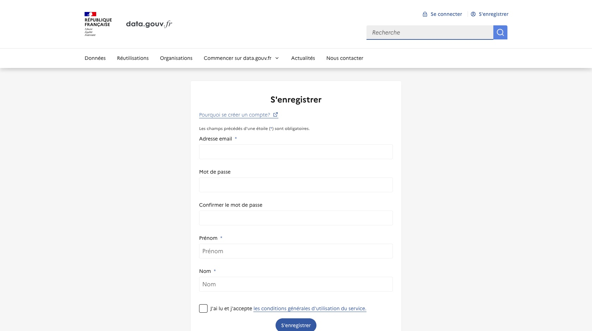

# Créer un compte utilisateur

La première étape pour publier des jeux de données sur data.gouv.fr est de [créer un compte utilisateur](https://doc.data.gouv.fr/gestion-du-compte/creer-un-compte/). Une fois ce compte confirmé par email, vous avez la possibilité de :
- mettre en ligne des données ;
- référencer des réutilisations de données ;
- ouvrir une discussion au sujet d’un jeu de données ;
- suivre les publication d’un autre utilisateur ;
- créer, rejoindre, ou suivre une organisation.

Dès lors que vous disposez d’un compte utilisateur,  votre profil est rattaché à différentes informations : 
- vos dernières activités sur data.gouv.fr (publication, mise à jour, 
- commentaire, réutilisation etc.) ;
- les utilisateurs abonnés à votre activité ;
- les jeux de données que vous suivez ;
- les jeux de données que vous avez publiés ;
- les réutilisations que vous avez publiées ;
- les organisations auxquelles vous appartenez.
