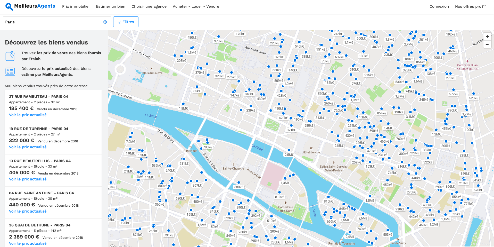

# Animer la communauté de réutilisateurs

## Partager son jeu de données et ses ressources 

Une fois que votre jeu de données est publié sur data.gouv.fr, nous vous conseillons de partager cette publication sur les réseaux sociaux.

Tout jeu de données peut être intégré sur d’autres sites web. Pour cela, il suffit de générer le code HTML du jeu de données depuis sa page associée, grâce à l’icône. 

Plusieurs jeux de données peuvent être intégrés sur une même page web. Vous pouvez également contrôler l’apparence du jeu de données intégré en modifiant la classe CSS dataset-card. 

## Valoriser les usages des données

::: tip Qu’est-ce qu’une réutilisation  ?
Un réutilisation est le résultat de l’exploitation des ressources d’un jeu de données publiées à d’autres fins que celles pour lesquelles les données ont été produites. 
:::

Les réutilisateurs des ressources publiées ont la possibilité de [référencer leur réutilisation](https://doc.data.gouv.fr/reutilisations-et-discussions/associer-une-reutilisation-a-un-jeu-de-donnees/) sur data.gouv.fr, en la liant au jeu de données réutilisé. Le référencement des réutilisation permet de :
- donner de la visibilité à la réutilisation et/ou au projet ;
- montrer le potentiel de réutilisation du jeu de données ;
- inspirer d’autres réutilisations ;
- engager un dialogue entre le producteur et le réutilisateur du jeu de données.

> **Base de demandes de valeurs foncières (DVF)**
> * Le [jeu de données](https://www.data.gouv.fr/fr/datasets/demandes-de-valeurs-foncieres/) recense l’ensemble des transactions immobilières intervenues au cours des cinq dernières années. Pour chaque transaction, le jeu de données indique l’adresse du bien cédé, le prix du bien cédé, la date de transaction, le type de la transaction, la description du bien et les références cadastrales.
> * Dès leur ouverture, les données foncières ont largement été ré-utilisées par les citoyens, les acteurs publics et les entreprises. La start-up MeilleursAgents a regroupé sur une carte interactive une partie de ces données. Leur visualisation permet de localiser les biens vendus et d’y associer la date et le prix de la transaction ainsi que les informations du bien. La mise à disposition de cette carte interactive aide les particuliers à fixer le juste prix de vente ou d’achat d’un bien immobilier. 

## Répondre aux questions posées à propos d’un jeu de données

Lorsque vous publiez un jeu de données ou une réutilisation sur data.gouv.fr, tout utilisateur qui dispose d’un compte data.gouv.fr peut ouvrir des discussions sur la page du jeu de données. Ces discussions permettent aux réutilisateurs des données de poser des questions au producteur, de faire remonter des erreurs constatées dans le jeu de données ou de proposer des améliorations. 

Vous avez la possibilité de [récupérer le lien d’une discussion ou d’un commentaire, d’ajouter un commentaire et de fermer une discussion](https://doc.data.gouv.fr/reutilisations-et-discussions/moderer-une-discussion/). Les discussions publiées sont visibles par tous les visiteurs de data.gouv.fr.

