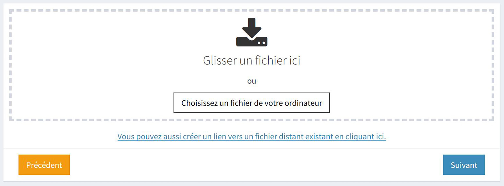
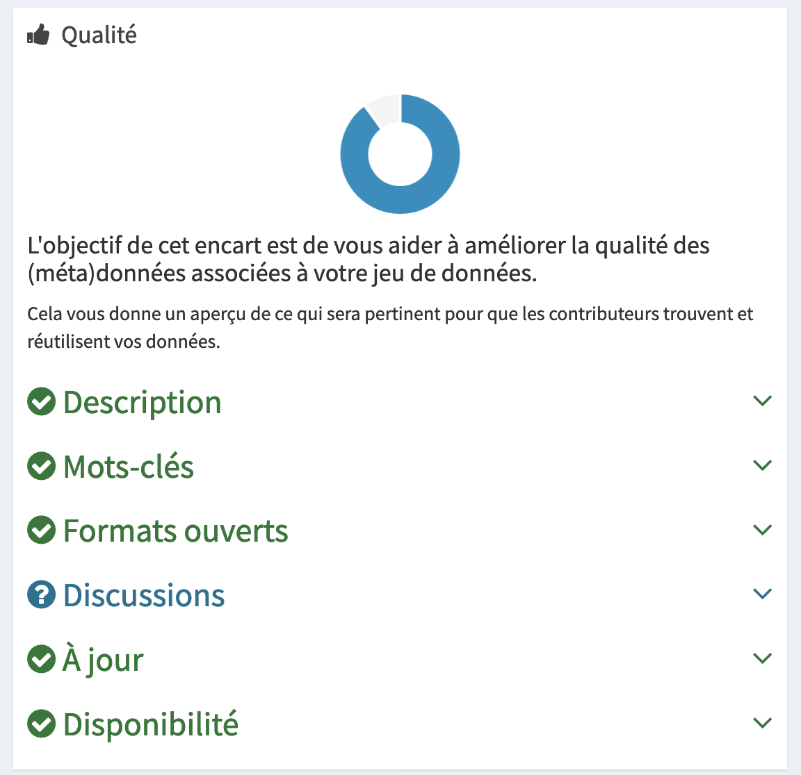

# Publier un jeu de données

## Définir qui publie le jeu de données

Un jeu de données peut être publié sous le nom de votre compte utilisateur ou sous la bannière d’une organisation.

### Quand est-il conseillé de publier sous le nom de votre compte utilisateur ?
Nous vous conseillons de publier un jeu de données sous le nom de votre compte utilisateur s’il n’a pas été produit dans le cadre des activités d’une organisation à laquelle vous êtes rattaché. 

### Quand est-il conseillé de publier au nom d’une organisation ?
Nous vous conseillons de publier un jeu de données au nom d’une organisation s’il a été produit ou reçu dans le cadre des activités de cette organisation. Tous les jeux de données peuvent être édités par les membres de l’organisation. Les jeux de données seront centralisés et facilement accessibles pour les réutilisateurs et nouveaux membres de l’organisation. 

## Décrire le jeu de données

Afin de présenter le jeu de données aux utilisateurs de data.gouv.fr, il est nécessaire de décrire les données que vous publiez. Cette étape est cruciale pour que vos jeux de données soient bien référencés et que les réutilisateurs s’approprient facilement les ressources partagées.  Lors de la création de la page de votre jeu de données, vous avez la possibilité de renseigner les informations suivantes: 

| Information                                                                                                                         |   Description de l'information                                                                                                                                                                                                                                                                                                                                                                                                                                                                                                                                                                                                                                                                                                           |
| ------------------------------------------------------------------------------------------------------------------------------------| -----------------------------------------------------------------------------------------------------------------------------------------------------------------------------------------------------------------------------------------------------------------------------------------------------------------------------------------------------------------------------------------------------------------------------------------------------------------------------------------------------------------------------------------------------------------------------------------------------------------------------------------------------------------------------------------------------------------------------------------| 
| [Titre*   ](https://doc.data.gouv.fr/jeux-de-donnees/publier-un-jeu-de-donnees/#titre)                                              |   Le titre de votre jeu de données doit être le plus précis et spécifique possible. Il doit également correspondre au vocabulaire employé par les utilisateurs. Ces derniers recherchent les données le plus souvent dans un moteur de recherche.                                                                                                                                                                                                                                                                                                                                                                                                                                                                                        | 
| [Sigle](https://doc.data.gouv.fr/jeux-de-donnees/publier-un-jeu-de-donnees/#sigle)                                                  |   Vous avez la possibilité d’apposer un sigle à votre jeu de données. Les lettres qui composent ce sigle n’ont pas besoin d’être séparées par des points.                                                                                                                                                                                                                                                                                                                                                                                                                                                                                                                                                                                | 
| [Description](https://doc.data.gouv.fr/jeux-de-donnees/publier-un-jeu-de-donnees/#description)*                                     |   La description de votre jeu de données permet aux personnes qui le consultent d’obtenir des informations sur le contenu et la structure des ressources publiées, le contexte de production des données, les contacts producteurs etc. C’est généralement la première chose que les utilisateurs lisent quand ils découvrent votre jeu de données.                                                                                                                                                                                                                                                                                                                                                                                      | 
| [Licence](https://doc.data.gouv.fr/jeux-de-donnees/publier-un-jeu-de-donnees/#licence)                                              |   Les licences définissent les règles de réutilisation des jeux de données publiés. En choisissant une licence de réutilisation, vous vous assurez que le jeu de données publié sera réutilisé selon les conditions d’usage que vous avez définies.Afin d’éviter la multiplication des licences, la[ loi pour une République numérique](https://www.legifrance.gouv.fr/affichTexteArticle.do?cidTexte=JORFTEXT000033202746&idArticle=JORFARTI000033203004&categorieLien=cid) a prévu la création d’une liste de licences qui peuvent être utilisées par les administrations. Le site data.gouv.fr[ a référencé la liste des licences applicables](https://www.data.gouv.fr/fr/licences) aux informations publiques (données, documents…).| 
| [Fréquence de mise à jour](https://doc.data.gouv.fr/jeux-de-donnees/publier-un-jeu-de-donnees/#fr%C3%A9quence-de-mise-%C3%A0-jour)*|   La fréquence de mise à jour correspond à la fréquence à laquelle vous prévoyez de mettre à jour les données publiées. Cette fréquence de mise à jour reste indicative.                                                                                                                                                                                                                                                                                                                                                                                                                                                                                                                                                                 | 
| [Mots clés](https://doc.data.gouv.fr/jeux-de-donnees/publier-un-jeu-de-donnees/#mots-clefs)                                                                                                                          |   Les mots clés caractérisent votre jeu de données. Ils apparaissent sur la page de présentation et apportent un meilleur référencement du jeu de données lors d’une recherche utilisateur.  L’apposition d’un mot clé permet également de classer votre jeu de données dans des thématiques. À partir de chaque mot clé, vous pouvez obtenir la liste des jeux de données pour lesquels le mot clé a également été assigné.                                                                                                                                                                                                                                                                                                             | 
| [Couverture temporelle](https://doc.data.gouv.fr/jeux-de-donnees/publier-un-jeu-de-donnees/#couverture-temporelle)                                                                                                               |   La couverture temporelle indique la portée dans le temps des données publiées                                                                                                                                                                                                                                                                                                                                                                                                                                                                                                                                                                                                                                                          |  
| [Granularité spatiale](https://doc.data.gouv.fr/jeux-de-donnees/publier-un-jeu-de-donnees/#granularit%C3%A9-spatiale)                                                                                                                |   La granularité spatiale indique le niveau de détail géographique le plus fin que peut couvrir vos données.                                                                                                                                                                                                                                                                                                                                                                                                                                                                                                                                                                                                                             | 
| [Mode privé](https://doc.data.gouv.fr/jeux-de-donnees/publier-un-jeu-de-donnees/#priv%C3%A9)                                                                                                                         |   L’activation du mode privé permet de ne pas mettre en ligne le jeu de données. Cela laisse la possibilité de l’éditer avant sa publication.                                                                                                                                                                                                                                                                                                                                                                                                                                                                                                                                                                                            | 

*Il est obligatoire de renseigner ces informations. 

## Ajouter les ressources 

::: tip  Qu’est ce qu’une ressource ? 
 Une ressource est un fichier téléchargeable  qui contient des informations à propos du jeu de données. Un jeu de données peut contenir plusieurs ressources (données mises à jour, données historisées, documentation, code source, API, lien, etc.).
::: 

Vous avez la possibilité d’importer vos ressources sur data.gouv.fr selon différents modes de mise à disposition. 

### Mise à disposition directe sur data.gouv.fr

Vous avez la possibilité d’importer vos ressources directement depuis la plateforme data.gouv.fr. Les étapes de cette publication reprend les étapes précédemment citées: 

Lors de l’étape “Ajoutez vos ressources”, deux options vous sont proposées: 
1. Vous pouvez télécharger vos ressources depuis votre ordinateur vers le serveur de data.gouv.fr. Vos ressources seront alors hébergées sur les serveurs de data.gouv.fr.
2. Vous pouvez créer un lien vers une ressource distante existante. Les informations contenues dans le fichier resteront hébergées sur le serveur distant fléché. 

### Mise à disposition par API

::: tip Qu’est ce qu’une API ?
Une API est une interface, un contrat passé entre deux systèmes informatiques pour leur permettre de communiquer. Cette solution informatique permet d’automatiser des tâches depuis votre ordinateur ou vos serveurs.
:::

Dans l’administration, les API sont déjà largements utilisées. Par exemple, les entreprise françaises utilisent tous les mois celle de la Déclaration Sociale Nominative. Les entreprises, elles, ne communiquent pas les données de leur employés manuellement à l’administration : leur logiciel de paie transmet directement ces données grâce à une API.

A partir de l’API de data.gouv.fr, vous pouvez réaliser les mêmes actions que sur la plateforme :
- Vous pouvez créer un jeu de données au nom de votre compte utilisateur ou au nom de votre organisation ;
- Vous pouvez décrire votre jeu de données et les ressources associées ;
- Vous pouvez ajouter ou supprimer une ressource ou un jeu de données.

L’API de data.gouv.fr propose également des fonctionalités complémentaires 
à la publication de jeux de données : 
- Vous pouvez récupérer les métadonnées des jeux de données ou ressources publiées sur data.gouv.fr ;
- Vous pouvez accéder au contenu des ressources d’un jeu de données. 

### Quand utiliser l’API de data.gouv.fr ?
À la différence du mode de mise à disposition directe des données sur data.gouv.fr, l’utilisation de l’API permet de réaliser des actions de manière automatisée depuis votre ordinateur ou vos serveurs. Il est par conséquent conseillé d’utiliser une API lorsque la fréquence de publication d’un jeu de données est régulière. 

### Comment utiliser l’API de data.gouv.fr ?
L’utilisation de l’API de data.gouv.fr se fait par le point d’entrée racine de l’API. Afin de pouvoir exécuter des opérations d’écriture, il est nécessaire d’obtenir une clé API. Cette clé est accessible depuis les paramètres de votre profil administrateur.

A partir de la clé API,  vous pouvez exécuter différentes opérations. Ces opérations sont référencées dans [la documentation disponible sur doc.data.gouv.fr](https://doc.data.gouv.fr/api/reference/). 

Les appels à l’API sont soumis aux mêmes permissions que l’interface web.  Par exemple, si vous souhaitez publier ou modifier un jeu de données au nom d’une organisation, vous devez appartenir à cette organisation.

Il ne vous reste plus qu'à publier votre jeu de données ! 

## Publier un catalogue de données existant par moissonnage 

::: tip Qu’est ce que le moissonnage ?
 Le moissonnage est un mécanisme permettant de collecter les métadonnées sur un catalogue distant et de les stocker sur une autre plateforme afin de proposer un second point d’accès aux données.
 :::

Le service de moissonnage mis à votre disposition permet de référencer sur data.gouv.fr les jeux de données publiés sur d’autres catalogues de données en ligne. De cette manière, vous n’avez pas besoin d’importer à la main sur data.gouv.fr les jeux de données que vous avez déjà importés sur votre propre plateforme.

### Quand utiliser le service de moissonnage ?
Si vous mettez en ligne des données publiques sur une plateforme ouverte, dans un format dont les métadonnées correspondent à la syntaxe ODS, CKAN, ou DCAT vous pouvez les référencer automatiquement sur data.gouv.fr en utilisant notre service de moissonnage.

### Comment utiliser le service de moissonnage ?
Il est possible de demander au moissonneur d’importer l’ensemble des données ou de ne sélectionner que certains jeux de données au moyen de filtres. Il n’est pas nécessaire de créer un moissonneur par jeu de données à importer, un seul moissonneur par portail suffit.

Le principe du moissonnage sur data.gouv.fr se décompose en plusieurs étapes :
1. Vous [créez un moissonneur sur data.gouv.fr](https://doc.data.gouv.fr/jeux-de-donnees/demander-a-datagouvfr-de-moisonner-votre-site/)afin que la plateforme suive l’activité de votre plateforme ;
2. Vous publiez des données sur votre plateforme d’open data ;
3. Le moissonneur de data.gouv.fr vient automatiquement récupérer les données de votre plateforme ;
4. Les données de votre plateforme sont référencées et visibles sur data.gouv.fr.

## Faire vivre son jeu de données

### Obtenir des informations à propos de votre jeu de données

Afin de suivre la vie de votre jeu de données sur data.gouv.fr, vous avez la possibilité de suivre ses statistiques d’utilisation depuis votre compte administrateur. Un tableau de bord centralise les informations relatives au jeu de données :
- Sa couverture temporelle, sa fréquence de mise à jour et ses mots-clés ; sa couverture spatiale ;
- son statut de disponibilité et les téléchargements associés à chaque ressource publiée ; 
- ses réutilisations ;
- ses anomalies ; 
- ses abonnés ; 
- ses ressources communautaires.

> Des statistiques d’audience et de téléchargement sont également disponibles sur www.stats.data.gouv.fr pour chacun de vos jeux de données. 

#### Qualité du jeu de données
La qualité de votre jeu de données est fondamentale pour qu’il soit réutilisé par le plus d’utilisateurs possible. Afin de vous guider, un encart “Qualité” est mis à votre disposition dans le tableau de bord de chaque jeu de données. L’objectif est de vous aider à améliorer la qualité des (méta)données à partir de six critères :
- Le jeu de données possède t-il une description ?
- Des mots clés sont-ils associés à votre jeu de données ? 
- Le format du jeu de données est-il ouvert ? 
- Des discussions à propos du jeu ont-elles été ouvertes ? 
- Le jeu de donnée est-il à jour ? 
- Les ressources du jeu de données sont-elles accessibles ? 

### Mettre à jour ou modifier un jeu de données et/ou une ressource

Les données publiées sur data.gouv.fr peuvent être [mises à jour après leur publication](https://doc.data.gouv.fr/jeux-de-donnees/mettre-a-jour-un-jeu-de-donnees-ou-une-ressource/), que la modification porte sur un jeu de données (sa description, ses tags, etc.) ou sur l’une des ressources qu’il contient.

Un producteur qui s’engage dans une logique de publication de ses données a intérêt à actualiser les ressources publiées le plus souvent possible. Ce critère de fraîcheur est critique pour les réutilisateurs qui fondent leurs services et produits sur les données publiées sur data.gouv.fr.

::: tip Rappel juridique
Les producteurs de données dont la publication présente un intérêt économique, social, sanitaire ou environnemental sont tenus de mettre à jour régulièrement les jeux de données publiés (Article L312-1-1 du CRPA). 
:::

### Transférer un jeu de données

Un jeu de données publié au nom d’un individu ou d’une organisation peut être [transféré vers un autre individu ou une autre organisation](https://doc.data.gouv.fr/jeux-de-donnees/transferer-un-jeu-de-donnees/).

### Supprimer un jeu de données ou une ressource

Vous pouvez [supprimer un jeu de données, ou l’une des ressources qui le compose](https://doc.data.gouv.fr/jeux-de-donnees/mettre-a-jour-un-jeu-de-donnees-ou-une-ressource/), si vous êtes l’auteur du jeu de données en question, ou si vous appartenez à l’organisation qui en est à l’origine. La suppression d’un jeu de données ou d’une ressource est irréversible.

::: tip Attention 
Il est conseillé de supprimer le moins de ressources possibles de la plateforme data.gouv.fr. Même si vos données ne sont plus mises à jour il est possible que des utilisateurs utilisent tout de même ces données. De plus, la suppression de certaines ressources peut entraîner la maintenance de nombreux services ou produits qui reposent sur l’exploitation des données publiées. 
:::

