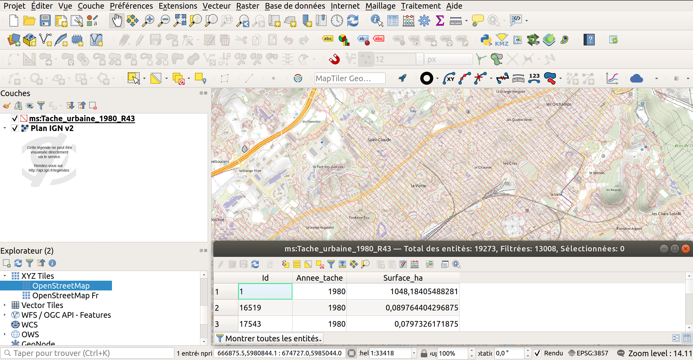
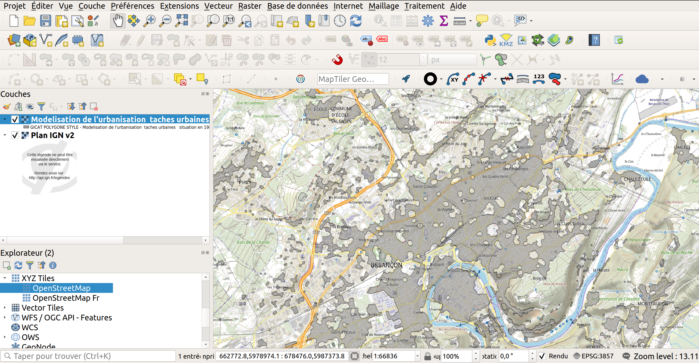

# Consommer les ressources distantes géospatiales sur data.gouv.fr

Le portail data.gouv.fr référence de nombreuses données OpenData. Certaines sont directement mises à disposition sur le site, d'autres jeux de données référencent des pages tierces avec les jeux de données ou bien un jeu de donnée référence une URL distante.

Nous allons nous concentrer sur le dernier cas en nous concentrant sur une partie spécifique, la donnée géospatiale. Si vous êtes plutôt intéressés par les API, nous documentons déjà [l'API Adresse](/apis-geo/1-api-adresse.html), [l'API découpage administratif](/apis-geo/2-api-decoupage-administratif.html) et [les API d'accès aux tuiles vectorielles](/apis-geo/3-tuiles-vecteur.html)

## Pourquoi abordons nous spécifiquement ce cas?

Dans un passé pas si lointain, Etalab entretenait le site geo.data.gouv.fr mais la maintenance étant consommatrice de ressources, des choix pour le décommissionner ont été fait. Voir [l'article "Extinction de geo.data.gouv.fr" pour en savoir plus](https://www.data.gouv.fr/fr/posts/extinction-de-geo-data-gouv-fr/)

La problématique est que la plateforme permettait de mettre en cache des données géospatiales qui sont normalement mises à disposition sous forme de service web, difficilement accessibles pour les néophytes. Généralement, ces formats ne sont bien compris par des spécialistes dans les données géographiques qu'on désigne sous des termes peu connu comme géomaticiens (métier associé au mot géographie et informatique), spécialiste SIG (Système d'Information Géographique) ou SIGiste. Le but est de rémédier à cette situation en facilitant la compréhension pour mieux réutiliser la donnée.

La plateforme data.gouv.fr avec l'extinction de geo.data.gouv consomme maintenant les données de catalogues contenant des données géospatiales, en particulier le geocatalogue. On parle de métadonnées. Ces dernières contiennent les descriptions des jeux de données et des listes de service.

Ces services peuvent prendre la forme:

- de service pour afficher des données vecteur et/ou télécharger la donnée sous forme de flux (WFS)
- de services pour consommer des fichiers directement téléchargeables (Atom)
- de service pour l'affichage sous forme d'image et l'interrogation ponctuelle (WMS),

## L'intérêt des 3 cas illustrés:

Nous n'insistons pas ici sur les modalités pour faire les opérations mais sur l'intérêt que cela présente

### WFS (Web Feature Service)

**Cas 1**:

Vous souhaitez disposer de données mises à jour régulièrement. Le WFS est un bon moyen pour cela car il contient les géométries et les attributs des données. Il vous permet d'avoir d'un côté la possibilité de rajouter un style comme si vous aviez un fichier SIG local type Shapefile/shp. Ainsi, on peut appliquer un style sur le WFS très facilement comme ci-dessous où on applique des motifs et où on a surtout accès aux attributs de la donnée visualisable sous forme tabulaire.
[url pour l'accès aux données sous forme GML, ouvrable dans le navigateur](https://ogc.geo-ide.developpement-durable.gouv.fr/wxs?map=/opt/data/carto/geoide-catalogue/1.4/org_38154/aea04585-605e-4372-abec-ade0d2380076.internet.map&SERVICE=WFS&REQUEST=GetFeature&VERSION=2.0.0&TYPENAMES=ms:Tache_urbaine_1980_R43&TYPENAME=ms:Tache_urbaine_1980_R43&STARTINDEX=0&COUNT=1000&SRSNAME=urn:ogc:def:crs:EPSG::3857&BBOX=668531.10646645340602845,5980808.73755011521279812,673071.40539349929895252,5985008.62458097562193871,urn:ogc:def:crs:EPSG::3857)

Il économise de l'espace disque et/ou de la bande passante car il permet de ne récupérer la donnée que sur une emprise géographique ou des filtres suivant des conditions dans les champs et pas uniquement tout le jeu de données.

Les inconvénients: il peut s'avérer long à afficher car le contenu distant peut s'avérer lourd donc long à récupérer via votre connexion internet. Vous risquez d'avoir un jour le flux qui s'arrête donc plus rien à consommer.



**Cas 2**:

Vous pouvez aussi récupérer ce WFS et l'avoir sous forme de fichier sur votre machine. Cela évite si la donnée n'est pas mis à jour de la récupérer en permanence et d'avoir la lenteur du réseau qui vous affecte et ne plus dépendre du service si celui-ci disparait ou change (par exemple, ajout/suppression de colonnes ou nouvelle manière de remplir un même champ). Si c'est possible, il souvent recommandé de passer par le flux Atom s'il est disponible.

### Flux Atom

Il s'agit d'un format qui permet de diffuser une liste de flux pour permettre de suivre les mises à jour de données. *Il permet aussi de récupérer les données associées à un WFS et/ou un WMS.*

Dans le meilleur des cas, on a correspondance entre un flux WMS pour visualiser sous forme image, un WFS pour de la consultation en ligne vecteur ou du téléchargement et un flux Atom pour télécharger. Dans cette configuration, il faut généralement privilégier le flux Atom si on veut les données sur sa machine.

C'est le cas pour les données précédemment montrées en aperçu où on dispose [d'un jeu de données Atom](https://demo.data.gouv.fr/fr/datasets/service-de-telechargement-simple-atom-du-jeu-de-donnees-modelisation-de-lurbanisation-taches-urbaines-situation-en-1980-en-franche-comte/).


Dans ce cas précis, vous allez récupérer un ensemble de fichiers qui viennent du logiciel MapInfo car ils contiennent un fichier tab accompagné d'autres fichiers portant le même nom mais avec une autre extension (on parle de [format MapInfo Tab](https://en.wikipedia.org/wiki/MapInfo_TAB_format)) et un XML qui contient les métadonnées du fichier.

### WMS (Web Map Service)

Vous ne souhaitez pas télécharger les données mais les regarder dans votre SIG ou dans votre WebSIG, vous passez par un WMS. Pour illustrer, voici un exemple ci-dessous avec la superposition "Modelisation de l'urbanisation  taches urbaines situation en 1980 en Franche Comte" ([url de l'image consultable dans le navigateur](https://ogc.geo-ide.developpement-durable.gouv.fr/wxs?map=/opt/data/carto/geoide-catalogue/1.4/org_38154/aea04585-605e-4372-abec-ade0d2380076.internet.map&SERVICE=WMS&VERSION=1.3.0&REQUEST=GetMap&BBOX=47.22558937316511418,5.983535451947194161,47.2768081055695788,6.065107850359938269&CRS=EPSG:4326&WIDTH=1345&HEIGHT=845&LAYERS=Tache_urbaine_1980_R43&STYLES=&FORMAT=image/png&DPI=192&MAP_RESOLUTION=192&FORMAT_OPTIONS=dpi:192&TRANSPARENT=TRUE)) sur un fond de plan IGN



## Prérequis:

Il est utile, voire nécessaire d'installer QGIS sur votre machine. Allez sur [la page officielle QGIS "Téléchargez QGIS"](https://www.qgis.org/fr/site/forusers/download.html) puis déplier le menu "Téléchargement pour Windows". Un gros bouton vert "Télécharger QGIS 3.28" apparaît . Si vous voulez les dernières fonctionnalités, téléchargez le fichier puis faites du "Suivant Suivant" pour installer QGIS.

Il faut noter la présence d'un texte juste en dessous du gros bouton vert, "En quête de la version la plus stable? Télécharger QGIS 3.22 LTR". Ceux qui prennent cette version cherche un support plus long dans le temps même s'ils ne disposeront de ce fait pas des fonctionnalités récemment introduites. Généralement, ce sont des entreprises, des collectivités qui préfèrent cette option afin de faire une mise à jour moins régulière pour maintenir leurs parcs de machine.

## Consommer le WFS

WFS comme Web Feature Service est un standard créé par [l'OGC](https://www.ogc.org) (comme Open Geospatial Consortium) qui permet de consommer des "features" (objets géographiques), c'est à dire des données vectorielles.

### Le standard WFS

Il existe plusieurs types de requêtes pour interroger un serveur WFS

- `GetCapabilities`. Cette opération permet de lister les informations sur le producteur du service, les lister les opérations autorisées, d'inventorier les couches d'information disponibles <https://ogc.geo-ide.developpement-durable.gouv.fr/wxs?map=/opt/data/carto/geoide-catalogue/1.4/org_38154/aea04585-605e-4372-abec-ade0d2380076.internet.map&SERVICE=WFS&VERSION=2.0.0&REQUEST=GetCapabilities>.

- `GetFeature`. Cette opération permet de retourner les features (objets géographiques). Ils peuvent être filtrés et paginés selon la configuration. Voir les exemples pour une couche mais en limitant à une objet (pour limiter le temps de réponse du WFS).
  * WFS 2.0 <https://ogc.geo-ide.developpement-durable.gouv.fr/wxs?map=/opt/data/carto/geoide-catalogue/1.4/org_38154/aea04585-605e-4372-abec-ade0d2380076.internet.map&SERVICE=WFS&VERSION=2.0.0&REQUEST=GetFeature&typenames=ms:Tache_urbaine_1980_R43&count=1>
  * WFS 1.1.0 <https://ogc.geo-ide.developpement-durable.gouv.fr/wxs?map=/opt/data/carto/geoide-catalogue/1.4/org_38154/aea04585-605e-4372-abec-ade0d2380076.internet.map&SERVICE=WFS&VERSION=1.1.0&REQUEST=GetFeature&typenames=ms:Tache_urbaine_1980_R43&maxFeatures=1>

- `DescribeFeatureType`. Cela permet de connaitre la structure des colonnes du flux WFS. Voir par exemple <https://ogc.geo-ide.developpement-durable.gouv.fr/wxs?map=/opt/data/carto/geoide-catalogue/1.4/org_38154/aea04585-605e-4372-abec-ade0d2380076.internet.map&service=wfs&version=2.0.0&request=DescribeFeatureType&typeNames=ms:Tache_urbaine_1980_R43> qui retourne une sortie du type

```xml
<?xml version='1.0' encoding="UTF-8" ?>
<schema
   targetNamespace="http://mapserver.gis.umn.edu/mapserver" 
   xmlns:ms="http://mapserver.gis.umn.edu/mapserver" 
   xmlns:xsd="http://www.w3.org/2001/XMLSchema"
   xmlns="http://www.w3.org/2001/XMLSchema"
   xmlns:gml="http://www.opengis.net/gml/3.2"
   elementFormDefault="qualified" version="0.1" >

  <import namespace="http://www.opengis.net/gml/3.2"
          schemaLocation="http://schemas.opengis.net/gml/3.2.1/gml.xsd" />

  <element name="Tache_urbaine_1980_R43" 
           type="ms:Tache_urbaine_1980_R43Type" 
           substitutionGroup="gml:AbstractFeature" />

  <complexType name="Tache_urbaine_1980_R43Type">
    <complexContent>
      <extension base="gml:AbstractFeatureType">
        <sequence>
          <element name="geometry" type="gml:SurfacePropertyType" minOccurs="0" maxOccurs="1"/>
          <element name="Id" minOccurs="0" type="string"/>
          <element name="Annee_tache" minOccurs="0" type="integer"/>
          <element name="Surface_ha" minOccurs="0" type="double"/>
        </sequence>
      </extension>
    </complexContent>
  </complexType>

</schema>
```

On déduit que la couche `Tache_urbaine_1980_R43` dispose des colonnes `Id` de type `string`, `Annee_tache` de type `integer` et `Surface_ha` de type `double` et que la couche dispose d'une géométrie de type polygone.

Il existe une version du WFS dite WFS-T comme Transactionnel. C'est à dire qui permet de la mise à jour de la base de données depuis un service WFS qui permet l'écriture et pas seulement la lecture. On ne détaille pas les opérations liées à ce dernier, étant dans une logique de consommation des données.

#### Pour en savoir plus

Voir les documentations suivantes :

- [Fiche WFS sur GeoRezo](https://georezo.net/wiki/main/standards/wfs)
- [Documentation WFS Geoserver (anglais)](https://docs.geoserver.org/stable/en/user/services/wfs/reference.html)
- [Documentation de l'OGC sur le WFS (anglais)](http://opengeospatial.github.io/e-learning/wfs/text/basic-index.html)
- [Spécifications OGC du WFS (anglais)](https://www.ogc.org/standards/wfs)


### L'écosystème autour du WFS

#### Client lourd SIG bureautique QGIS

Pour QGIS, vous pouvez prendre [le guide mis à disposition par l'IGN "Utiliser les données IGN en flux WFS"]( https://geoservices.ign.fr/documentation/services/utilisation-sig/tutoriel-qgis/wfs). Les instructions sont similaires, la seule chose qui change est l'URL à remplir.

#### WFS client léger

Pour l'affichage de carte en WFS,

- [OpenLayers](https://openlayers.org/en/latest/examples/?q=wfs)
- Maplibre GL JS. Démo non fournie car compliquée à gérer. Cela dépend en effet selon si le serveur WFS retourne les données sous forme GeoJSON ou pas, ce qui relève de WFS au cas par cas.
- Leaflet ([Démo dédiée](https://gist.githack.com/ThomasG77/ca2496faeca7b908ef88435a8d195c92/raw/ef2b761e4b22696a87d02606fe45a2ec1f6242db/index.html))

#### bibliothèques WFS côté serveur

- Utilitaires en ligne de commande de [GDAL](https://gdal.org) `ogrinfo` et `ogr2ogr`. Pour comprendre leur utilisation, voir le tutoriel pour le [WFS de l'IGN](https://guides.etalab.gouv.fr/apis-geo/2-api-decoupage-administratif.html#les-sources-alternatives-pour-les-communes). Ce qui change ici est le fait que les URLs changent mais les principes restent les mêmes.
- [owslib](https://geopython.github.io/OWSLib/usage.html#wfs) (Python)


## Consommer le WMS

### Le standard WMS

Ce standard WMS comme Web Map Service est ancien (1999). Il est comme le WFS, produit par l'OGC. Il est basé sur SOAP. La spécification a 2 versions officielles. Les serveurs généralement supportent 2 versions, la version 1.1.1 et la 1.3.0.

#### Les deux principaux types de requêtes

- `GetCapabilities` qui décrit ce que peut retourner le serveur pour un flux. Généralement, cela indique les informations du service comme la description, les contacts via le bloc `Service`; les opérations autorisées via le block `Request` les couches via des blocs `<Layer>` avec leur nom, leur description et les projections supportées. Vous pouvez inspecter cela via l'URL suivante <https://ogc.geo-ide.developpement-durable.gouv.fr/wxs?map=/opt/data/carto/geoide-catalogue/1.4/org_38154/aea04585-605e-4372-abec-ade0d2380076.internet.map&SERVICE=WMS&VERSION=1.3.0&REQUEST=GetCapabilities>

- `GetMap` qui permet de retourner une image en passant dans l'URL la taille de l'image souhaitée, le nom de la ou les couches souhaitées, la projection de l'image, les coordonnées de l'étendue de l'image (les "4 coins"), le format de l'image (jpeg, png) et d'autres options. C'est ce qu'on voit dans l'URL <https://ogc.geo-ide.developpement-durable.gouv.fr/wxs?map=/opt/data/carto/geoide-catalogue/1.4/org_38154/aea04585-605e-4372-abec-ade0d2380076.internet.map&SERVICE=WMS&VERSION=1.3.0&REQUEST=GetMap&BBOX=47.22558937316511418,5.983535451947194161,47.2768081055695788,6.065107850359938269&CRS=EPSG:4326&WIDTH=1345&HEIGHT=845&LAYERS=Tache_urbaine_1980_R43&STYLES=&FORMAT=image/png&DPI=192&MAP_RESOLUTION=192&FORMAT_OPTIONS=dpi:192&TRANSPARENT=TRUE>. Il est par ailleurs possible d'indiquer des styles soit internes soit externes dans l'appel pour que l'image change de style.

### Les types de requête optionnels

Ils existent des opérations optionnelles qui selon les serveurs sont activées ou non selon ce qui est indiqué dans le bloc `<Request>` de `GetCapabilities`

- `GetFeatureInfo`: permet d'interroger l'information qui est sous-jacente à l'image, généralement lors d'un clic ou d'un survol souris. <https://ogc.geo-ide.developpement-durable.gouv.fr/wxs?map=/opt/data/carto/geoide-catalogue/1.4/org_38154/aea04585-605e-4372-abec-ade0d2380076.internet.map&SERVICE=WMS&VERSION=1.3.0&REQUEST=GetFeatureInfo&BBOX=47.24844174314760181,6.02724062451449427,47.24849566040156645,6.0273200523610484&CRS=EPSG:4326&WIDTH=2&HEIGHT=2&LAYERS=Tache_urbaine_1980_R43&STYLES=&FORMAT=image/png&QUERY_LAYERS=Tache_urbaine_1980_R43&INFO_FORMAT=application/vnd.ogc.gml&I=0&J=1&FEATURE_COUNT=10>

- `DescribeLayer`: permet de spécifier à d'autres outils, où aller chercher la description de la structure des couches <https://ogc.geo-ide.developpement-durable.gouv.fr/wxs?map=/opt/data/carto/geoide-catalogue/1.4/org_38154/aea04585-605e-4372-abec-ade0d2380076.internet.map&SERVICE=WMS&VERSION=1.3.0&REQUEST=DescribeLayer&LAYERS=Tache_urbaine_1980_R43&SLD_VERSION=1.1.0> C'est surtout important si vous utilisez des styles dit SLD (pour "Styled Layer Descriptor"). Vous ne serez généralement pas concerné par cet usage.
- `GetLegendGraphic`: retourne la légende de la carte. Voici [un exemple d'appel à ce type d'opération](https://ogc.geo-ide.developpement-durable.gouv.fr/wxs?map=/opt/data/carto/geoide-catalogue/1.4/org_38154/aea04585-605e-4372-abec-ade0d2380076.internet.map&SERVICE=WMS&VERSION=1.3.0&REQUEST=GetLegendGraphic&LAYER=Tache_urbaine_1980_R43&FORMAT=image/png&SLD_VERSION=1.1.0). Comme pour `GetMap`, on peut spécifier un style si nécessaire.

#### Pour en savoir plus

Voir les documentations suivantes :

- [Fiche WMS sur GeoRezo](https://georezo.net/wiki/main/standards/wms)
- [Documentation WMS Geoserver (anglais)](https://docs.geoserver.org/stable/en/user/services/wms/reference.html)
- [Documentation de l'OGC sur le WMS (anglais)](http://opengeospatial.github.io/e-learning/wms/text/basic-index.html)
- [Spécifications OGC du WMS (anglais)](https://www.ogc.org/standards/wms)

### L'écosystème pour consommer des WMS

#### Client lourd SIG bureautique QGIS

Pour QGIS, vous pouvez prendre [le guide mis à disposition par l'IGN "Utiliser les données IGN en flux WMS/WMTS"](https://geoservices.ign.fr/documentation/services/utilisation-sig/tutoriel-qgis/wms-wmts). Les instructions sont similaires, la seule chose qui change est l'URL à remplir.

#### Client léger web

Pour utiliser les "capabilities" WMS,

**JavaScript**

- Via [wms-capabilities](https://www.npmjs.com/package/wms-capabilities) (extrait de OpenLayers pour être totalement indépendant)
- Via [JSONIX](https://github.com/highsource/jsonix) avec [ogc-schemas](https://www.npmjs.com/package/@ogc-schemas/ogc-schemas) (fonctionnement client comme serveur)
- Via Openlayers ([exemple officiel "WMS Capabilities Parsing" disponible](https://openlayers.org/en/latest/examples/wms-capabilities.html)) (fonctionnement client comme serveur)
- Via le [contrôle WMS Capabilities de la bibliothèque ol-ext](http://viglino.github.io/ol-ext/examples/layer/map.wmscapabilities.html?lon=2.344347&lat=48.855181&z=14.5) (extensions liées à la bibliothèque OpenLayers)

Pour l'affichage de carte en WMS (opération `GetMap`),

- [OpenLayers](https://openlayers.org/en/latest/examples/?q=wms)
- Maplibre GL JS. [Exemple non tuilé](https://gist.githack.com/ThomasG77/87da9421f89fc8290e6c3cc59251bdc9/raw/847bdec7c8d95cf9de0da6aad6d6b77e77f10bc9/index.html) et [tuilé](https://gist.githack.com/ThomasG77/6459d9b75a6c6bc2d757049c2e3d5858/raw/a1b5751afee6bbd06fc15bab8ff6846f31021ab7/index.html)
- Leaflet ([exemple](https://gist.githack.com/ThomasG77/f27f62d1e3fb6ea79b406fbfa5d004bb/raw/e25b4bef7574074ff1bfa1b2261e4a81ff3265eb/index.html))

Vous avoir un aperçu visuel rapide d'un couche, vous pouvez passer par le projet [mviewer](https://mviewer.netlify.app) comme illustré via [cet exemple via un proxy](https://kartenn.region-bretagne.fr/kartoviz/?x=706890&y=6242153&z=7&config=demo/addlayers.xml&addLayer={\%22url\%22:\%22https://corsproxy.io/?https://ogc.geo-ide.developpement-durable.gouv.fr/wxs?map%3D\/opt\/data\/carto\/geoide-catalogue\/1.4\/org_5443264\/ccf16ee8-5b97-4cf5-9257-c88102c106e2.internet.map\%22,\%22name\%22:\%22AGENDA21_S_R44\%22,\%22title\%22:\%22AGENDA21_S_R44\%22}#)

*Attention*: Pour le web, il faut généralement utiliser un proxy car tous les serveurs ne supportent pas qu'on accède depuis une page web à leur contenu hébergé sur un autre domaine. Il existe des proxy publics comme https://data.europa.eu/deu-proxy? ou https://corsproxy.io/? mais nous vous recommandons d'installer le vôtre si vous avez un usage en production. Il en existe dans la plupart des languages de programmation. Vous pouvez trouvez une liste sur <https://github.com/topics/cors-proxy?o=desc&s=stars> (filtrez selon votre language de programmation)

#### Liste des couches et leur description ou bien une vignette d'une zone sous forme image, pour un aperçu

**Python**

Avec [Owslib](https://geopython.github.io/OWSLib/)

```python
from owslib.wms import WebMapService

wms = WebMapService('https://ogc.geo-ide.developpement-durable.gouv.fr/wxs?map=/opt/data/carto/geoide-catalogue/1.4/org_38154/aea04585-605e-4372-abec-ade0d2380076.internet.map', version='1.3.0')

for operation in wms.operations:
    print(operation.name)
    print(operation.methods)
    print(operation.formatOptions)

for name, content_metadata in wms.items():
    print('crsOptions', content_metadata.crsOptions)
    print('crs_list', content_metadata.crs_list)
    print('dataUrls', content_metadata.dataUrls)
    print('defaulttimeposition', content_metadata.defaulttimeposition)
    print('dimensions', content_metadata.dimensions)
    print('elevations', content_metadata.elevations)
    print('featureListUrls', content_metadata.featureListUrls)
    print('fixedHeight', content_metadata.fixedHeight)
    print('fixedWidth', content_metadata.fixedWidth)
    print('id', content_metadata.id)
    print('index', content_metadata.index)
    print('keywords', content_metadata.keywords)
    print('layers', content_metadata.layers)
    print('max_scale_denominator', content_metadata.max_scale_denominator.text if content_metadata.max_scale_denominator is not None else None)
    print('metadataUrls', content_metadata.metadataUrls)
    print('min_scale_denominator', content_metadata.min_scale_denominator.text if content_metadata.min_scale_denominator is not None else None)
    print('name', content_metadata.name)
    print('noSubsets', content_metadata.noSubsets)
    print('opaque', content_metadata.opaque)
    print('parent', content_metadata.parent)
    print('queryable', content_metadata.queryable)
    print('scaleHint', content_metadata.scaleHint)
    print('styles', content_metadata.styles)
    print('timepositions', content_metadata.timepositions)
    print('title', content_metadata.title)
```

Pour les autres languages de programmation, il faut vous appuyer sur le parsing XML natif ou fournit par des bibliothèques tierces.

#### Manipulations WMS côté serveur

Python

```python
import json
import logging
from urllib.request import urlopen
from urllib.parse import urlparse
from owslib.wms import WebMapService

url_str = "https://demo.data.gouv.fr/fr/datasets/service-de-visualisation-cartographique-wms-du-jeu-de-donnees-driaaf-idf-territoire-maet-en-ile-de-france/"
url_parsed = urlparse(url_str)
slug = [i for i in url_parsed.path.split('/') if i != ''][-1]
base_url = f'{url_parsed.scheme}://{url_parsed.hostname}'
api_url = f'{base_url}/api/1/datasets/{slug}'

with urlopen(f'{api_url}/') as req:
    json_content = json.load(req)

wms_json = [i for i in json_content.get('resources') if 'WMS' in i.get('description') or 'WMS' in i.get('title')]
if len(wms_json) > 0:
    wms = WebMapService(wms_json[0].get('url'), version='1.3.0')
    print(wms.identification.type)
    print(wms.identification.title)
    print(wms.identification.abstract)
    print(wms.getOperationByName('GetMap').formatOptions)
    for name, layer in wms.items():
        # layer = wms.contents[name]
        print("Abstract: ", layer.abstract)
        print("BBox WGS84: ", layer.boundingBoxWGS84)
        print("BBox: ", layer.boundingBox)
        print("CRS: ", layer.crsOptions)
        print("Styles: ", layer.styles)
        print("Timestamps: ", layer.timepositions)
        print(layer.parent.abstract)
        sizex = 800
        # Ne fonctionne pas. Bug côté Geo-IDE sur le décodage de caractères
        # https://github.com/geopython/OWSLib/issues/846
        # Marche avec owslib 0.25.0 mais pas après
        response = wms.getmap(layers=[name,],
            bbox=layer.boundingBoxWGS84, # Left, bottom, right, top
            format=wms.getOperationByName('GetMap').formatOptions[0],
            size=(sizex,round(sizex * ((layer.boundingBoxWGS84[3] - layer.boundingBoxWGS84[1]) / (layer.boundingBoxWGS84[2] - layer.boundingBoxWGS84[0])))),
            srs='EPSG:4326',
        )
        with open(f"{name}.{wms.getOperationByName('GetMap').formatOptions[0].split('/')[-1]}", 'wb') as out:
            out.write(response.read())
else:
    print("Pas de WMS disponible")

```

Exemple retournant une image statique

```python
from owslib.wms import WebMapService

wms = WebMapService('https://ogc.geo-ide.developpement-durable.gouv.fr/wxs?map=/opt/data/carto/geoide-catalogue/1.4/org_38154/aea04585-605e-4372-abec-ade0d2380076.internet.map', version='1.3.0')

response = wms.getmap(layers=['N_PERIM_MAET_ZINF_S_R11',],
    bbox=(1.44041, 48.1107, 3.56583, 49.2484),
    format='image/png',
    size=(800, 428),
    srs='EPSG:4326',
)
with open(f"N_PERIM_MAET_ZINF_S_R11.png", 'wb') as out:
    out.write(response.read())
```

## ATOM = WFS sans la complication

ATOM est le format qui est utilisé dans les flux RSS. Il est enrichi dans le cas des catalogues de données géographiques.

Il contient pour le cas des données géographiques les URLs des données à télécharger. C'est le plus simple à utiliser si le seul but est de récupérer la donnée puis de la traiter, l'ouvrir dans ses propres outils. On télécharge les données des liens RSS. Il s'agit généralement de données géographiques dans des formats communément admis même si on peut parfois avoir des données attributaires et/ou des fichiers PDF par exemple.

Dans le meilleur des cas, on a un WMS avec un WFS et un flux ATOM mais cela dépend des flux de chaque fournisseur de données et on a le choix en fonction de nos usages souhaités.
