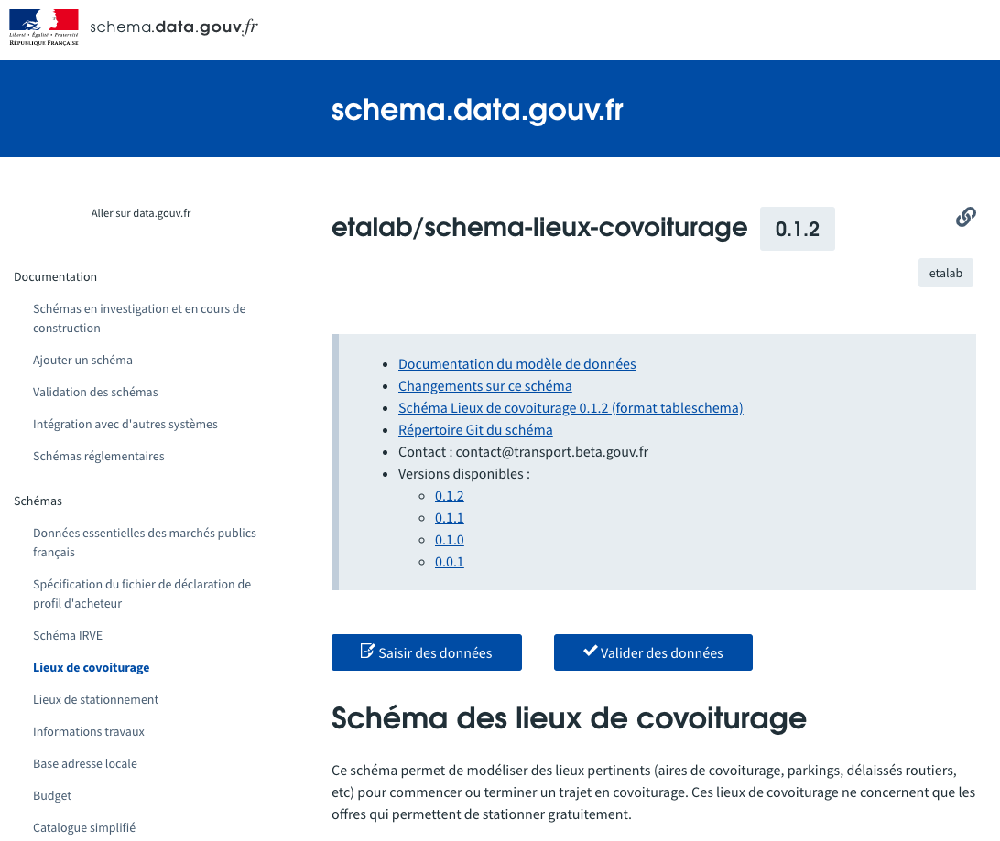

# Intégration avec schema.data.gouv.fr

[schema.data.gouv.fr](https://schema.data.gouv.fr) est l’initiative de [data.gouv.fr](https://data.gouv.fr) de référencement des schémas de données publiques pour la France. Cette plateforme de référencement nationale permet un accès aux schémas produits par différents acteurs et facilite l’intégration avec des systèmes informatiques par le biais de standards, d’URLs stables, de processus de validation et d’API.

Vous trouverez ci-dessous une capture d’écran de l’interface de schema.data.gouv.fr pour [le schéma dédié aux lieux de covoiturage](https://schema.data.gouv.fr/etalab/schema-lieux-covoiturage/latest.html).

## Qui peut référencer des schémas ?
Tout acteur est libre de proposer le référencement de schémas.

Concrètement, vous pouvez être une administration, une entreprise privée, une association etc.

## Quels schémas sont acceptés ?
[schema.data.gouv.fr](https://schema.data.gouv.fr) accepte des schémas décrivant des données publiques.

Les schémas sont acceptés dès lors que leur l’existence est justifiée par voie :
- **réglementaire** : le schéma a été introduit par une disposition réglementaire ;
- **d’usage** : la réutilisation des données décrites par le schéma bénéficie à un grand nombre ou de nombreux producteurs sont amenés à utiliser ce schéma.

Etalab se réserve le droit de refuser l’ajout de schémas en motivant son refus. Nous vous encourageons à [initier une discussion](https://github.com/etalab/schema.data.gouv.fr/issues) préalablement à l’ouverture d’une _pull request_.

## Quand référencer son schéma ?

Nous vous invitions à référencer votre schéma le plus tôt possible, **dès la phase d’investigation**. En référençant votre schéma en amont, vous bénéficierez de l’accompagnement d’Etalab et de partenaires tout au long de la création de votre schéma : de l’investigation à la publication sur [schema.data.gouv.fr](https://schema.data.gouv.fr).

Vous pouvez référencer votre schéma en ouvrant un ticket sur GitHub ou en entrant en contact [avec notre équipe par e-mail](mailto:schema@data.gouv.fr) Nous avons créé [une page dédiée pour détailler la procédure](https://schema.data.gouv.fr/documentation/schemas-investigation-construction). Nous tenons à jour une liste de schémas actuellement en phase d’investigation ou de construction sur cette même page.

## Quels schémas sont acceptés ?

[schema.data.gouv.fr](https://schema.data.gouv.fr) accepte des schémas décrivant des modèles de données à l’aide d’un standard. Les schémas décrits uniquement par de la documentation textuelle ou des tableaux ne sont pas acceptés.

### Standards supportés
Les standards de schémas actuellement supportés sont les suivants :

- [Table Schema](https://frictionlessdata.io/specs/table-schema/) : schéma au format JSON, permettant de décrire des données tabulaires (sous forme de tableurs ou de CSV) ;
- [JSON Schema](https://json-schema.org) : schéma au format JSON, permettant de décrire des documents JSON ;
- [XML Schema Definition (XSD)](https://www.w3.org/TR/xmlschema11-1/) : schéma au format XML, permettant de décrire des documents XML.

### Prérequis de validation des schémas

::: lexique Validation d’un schéma

La validation d’un schéma est l’étape permettant de vérifier qu’un schéma est conforme aux spécifications techniques du standard du schéma et aux prérequis de [schema.data.gouv.fr](https://schema.data.gouv.fr). La validation d’un schéma s’intéresse uniquement au schéma et à la façon dont il est publié.

Il ne faut pas confondre la validation d’un schéma avec le fait de vérifier que des données correspondent à un schéma.
::: 

Pour tous les types de schéma, il faut que :
- votre schéma soit sur un dépôt Git, à raison d’un dépôt par schéma. Ce dépôt doit pouvoir être cloné depuis Internet sans authentification préalable ;
- votre dépôt Git doit comporter des tags indiquant les versions de votre schéma. Ces versions doivent respecter la [gestion sémantique de version semver](https://semver.org/lang/fr/), sous la forme `1.3.2` par exemple ;
- votre dépôt doit comporter un fichier `README.md` à la racine contenant une documentation du schéma indiquant par exemple le contexte de production, la gouvernance ;
- passer avec succès les tests spécifiques au type de schéma que votre dépôt contient.

::: tip Critères complets de validation
Cette page présente les grands principes de validation des schémas. Pour connaître en détail les prérequis propres à chaque type de schéma et accéder à des exemples, consultez [la page dédiée à la validation des schémas](https://schema.data.gouv.fr/documentation/validation-schemas).
::: 

## Points de sortie
À l’issue de cette phase, vous devriez :

- Avoir pris connaissance des procédures de validation en place sur schema.data.gouv.fr ;
- Avoir un dépôt Git conforme aux prérequis de schema.data.gouv.fr ;
- Avoir effectué votre demande de référencement.
