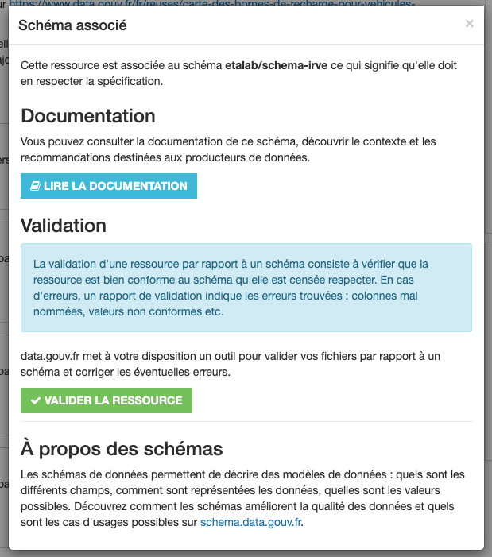

# Jeux de données sur data.gouv.fr et schémas

Une fois que votre schéma est finalisé et publié [schema.data.gouv.fr](https://schema.data.gouv.fr), il est temps de produire des données conformes à ce schéma.

[data.gouv.fr](https://data.gouv.fr) propose de multiples intégrations avec [schema.data.gouv.fr](https://schema.data.gouv.fr) permettant de spécifier qu'une ressource présente sur [data.gouv.fr](https://data.gouv.fr) est censée être conforme à un schéma. Il est ensuite possible de procéder à la validation de la ressource par rapport au schéma ou de consulter la documentation du schéma à partir de la page d'un jeu de données.

## Indiquer qu'une ressource respecte un schéma sur data.gouv.fr

Vous pouvez indiquer qu'une ressource d'un jeu de données correspond à un schéma depuis l'interface d'administration de data.gouv.fr. Lorsque vous déposez ou éditez une ressource, vous pouvez sélectionner le schéma correspondant à vos données depuis une liste déroulante.

Le fait d'indiquer que votre ressource est censée respecter un schéma permet de bénéficier de vérifications de la qualité des données et d'indiquer aux réutilisateurs que vos données respectent un référentiel.

