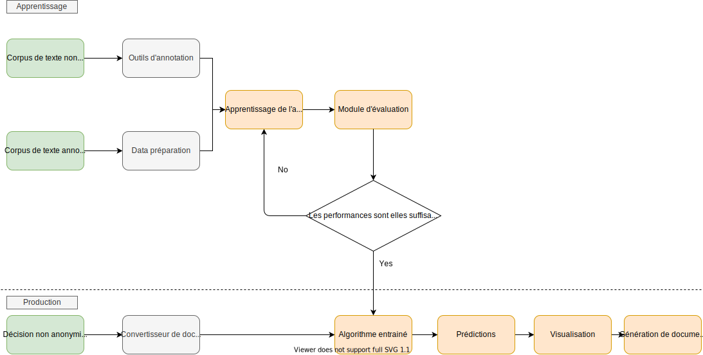

# La pseudonymisation par l'IA en pratique

Après avoir vu dans les grandes lignes les étapes d'un projet de pseudonymisation grâce à l'IA, nous revenons plus en détails dans cette partie sur ces différentes étapes pour présenter les choix, arbitrages et préconisations techniques que nous avons tirés de nos travaux pour la création d'un moteur de pseudonymisation pour les décisions du Conseil d'État. Ceux-ci sont disponibles [sur GitHub](https://github.com/etalab-ia/pseudonymisation_decisions_ce).

## Formater ses données annotées

Afin de pouvoir utiliser les données annotées pour l'entraînement d'un algorithme d'apprentissage, **celles-ci doivent être converties dans un format spécifique**. Dans l'exemple ci-dessous, un document textuel (ici "Thomas CLAVIER aime beaucoup Paris.") est alors structuré en un tableau, avec un mot par ligne, et deux colonnes, une pour le mot (ou *token*) et une pour l'annotation linguistique. 

| Token   | Label  | 
| ----------| ----------| 
| Thomas | B-PER | 
| CLAVIER | I-PER | 
| aime | O | 
| beaucoup | O | 
| Paris | B-LOC  | 

Nous utilisons le format BIO, très utilisé pour les tâches de reconnaissance d'entités nommées, pour labéliser nos données. Le préfixe B- avant un label indique que le label est le début d'un groupe de mots, le préfixe I- indique que le label est à l'intérieur d'un groupe de mots, et le label O indique que le token n'a pas de label particulier.

Pour aider au formatage des données, notre outil comporte une brique permettant de convertir des données au format JSON annotés par Doccano au format CONLL.  

::: tip Le format CoNLL
CoNLL, pour "Conference on Natural Language Learning", est un format général, dont il existe de nombreuses versions, couramment employé pour les tâches de NLP, décrivant des données textuelles en colonne selon un nombre d'attribut (catégorie d'entité nommée, nature grammaticale, etc.). Le format BIO que nous utilisons fait partie des formats CoNLL. 
:::

Il existe de très **nombreux logiciels ou solutions d'annotation de données textuelle**s et les données annotées en sortie peuvent donc avoir différents formats (il existe en effet de multiples formats de données annotées). Pour transformer vos données annotées, un développement spécifique sera probablement nécessaire afin de les convertir au format BIO, le format des données d'entrée de l'algorithme de reconnaissance d'entités nommées que nous avons choisi. Plusieurs exemples de fonctions et de librairies développées pour le Conseil d'État constitueront néanmoins un point de départ dans le répertoire GitHub.

::: tip Exemple de mise en œuvre : moteur de pseudonymisation pour le Conseil d'État
Le conseil d'État dispose de 250 000 décisions provenant des différents échelons de la justice administrative, qui ont été annotées de façon automatique par un moteur de règles. Parmi celles-ci, 25 000 avaient reçu une vérification manuelle. Le système de pseudonymisation automatique par moteur de règles a un **taux d'erreur élevé et nécessite une relecture manuelle** afin de garantir une bonne précision de la reconnaissance d'éléments identifiants. 
Afin d'entraîner un algorithme supervisé, nous avons utilisé un sous-échantillon de 5000 décisions parmi les 25 000 vérifiées à la main. Nous avons **sélectionné un sous-échantillon** car l'échantillon complet des données vérifiées manuellement était trop important au vue des ressources de calcul dont nous disposions pour l'entraînement du modèle.  
:::

## Tokéniser le texte

Si l'on considère un document, composé de blocs de caractères, la tokénisation est la tâche qui consiste à découper ce document en éléments atomiques, en gardant ou supprimant la ponctuation. Par exemple :  

| Phrase        | 
| :------------- |
| Mes amis, mes enfants, l'avènement de la pseudonymisation automatique est proche. | 

La phrase ci-dessus pourrait être tokenisée des manières suivantes :

| Token1   | Token2   | Token3   | Token4   | Token5   | Token6   | Token7   | Token8   | Token9   | Token10   | Token11   | Token12   | Token13   | Token14   | Token15   | Token16   |
| :----------| :----------| :----------| :----------| :----------| :----------| :----------| :----------| :----------| :----------| :----------|  :----------| :----------| :----------| :----------| :----------| 
| Mes  | amis  |  , | mes  | enfants  | ,   |l   | ' | avènement  | de   | la   |pseudonymisation| automatique| est  | proche  | .|
 

| Token1   | Token2   | Token3   | Token4   | Token5   | Token6   | Token7   | Token8   | Token9   | Token10   | Token11   |
| :----------| :----------| :----------| :----------| :----------| :----------| :----------| :----------| :----------| :----------| :----------| 
| Mes| amis| mes| enfants| l'avènement | de | la| pseudonymisation| automatique | est| proche|

**Les tokens correspondent généralement aux mots**, mais il est important de comprendre qu'une autre unité peut être choisie, par exemple les caractères. D'autres choix dans la façon de tokeniser peuvent avoir un impact sur les résultats de l'algorithme. Par exemple, le choix de conserver ou non la ponctuation a son importance. De manière pratique, il est important de bien comprendre la méthode de tokénisation utilisée par les algorithmes, afin de prendre en compte ces choix lors de l'étape finale d'occultation d'éléments identifiants dans le texte. Notre outil utilise les tokenisateurs du package **NLTK**, en particulier **WordPunctTokenizer** pour tokeniser une phrase en éléments, et **PunktSentenceTokenizer** pour découper le document en phrases (ou plus communément *sentences*, en anglais).

## Entraîner son modèle

Dans le code que nous avons développé, nous utilisons la librairie Open Source [Flair](https://github.com/flairNLP/flair). Celle-ci permet en effet d'utiliser de nombreux modèles de langage, et notamment les modèles Bert et CamemBERT, et même de combiner plusieurs modèles de langages. **Ce modèle de langage permet pour chaque mot d'obtenir une représentation vectorielle** (ou *embedding*). Cet embedding est ensuite passé à un classificateur BiLSTM-CRF qui attribue à chaque mot une des classes du jeu de données d'entrainement.

L'entrainement d'un tel classificateur nécessite de choisir la valeur d'un certain nombre d'**hyper-paramètres** (les hyper-paramètres sont les paramètres de l'algorithmes qui sont fixés avant l'apprentissage, par opposition aux paramètres de l'algorithmes qui sont fixés de manière itérative au cours de l'apprentissage). Des exemples de configuration avec des explications des différents hyper-paramètres et de leur impact sont disponibles dans la section correspondante du répertoire GitHub.  

Nous proposons un exemple de module permettant d'entrainer un algorithme de reconnaissance d'entités nommées via la librairie Flair à partir d'un corpus annoté. Enfin, pour aller plus loin, la librairie Flair propose [un module très pratique permettant de fixer les valeurs optimales des hyper-paramètres optimaux pour l'apprentissage](https://github.com/flairNLP/flair/blob/master/resources/docs/TUTORIAL_8_MODEL_OPTIMIZATION.md).

## Valider ses résultats

La validation des performances du modèle et la mise en production est un double processus reposant sur **l'analyse de métriques et sur l'expérience humaine**.

Notre module de génération de documents pseudonymisés permet de produire en sortie des fichiers labélisés, au format CoNLL. Ceci permet :
- d'utiliser des **métriques permettant de comparer**, pour un document ayant été annoté manuellement, la pseudonymisation par l'algorithme à celle réalisée manuellement. On utilise généralement le [score F1](https://fr.wikipedia.org/wiki/Pr%C3%A9cision_et_rappel) pour mesurer la performance du modèle ;
- de charger dans notre outil d'annotation basé sur Doccano un fichier **mettant en avant les différences entre les annotations provenant de sources différentes**, indiquant en rouge les labels en désaccord et en vert les labels en accord.

## Pseudonymiser un document

Le modèle entraîné permet d'attribuer une catégorie à chaque token du document à pseudonymiser. **Les sorties de l'algorithme de reconnaissance d'entités nommées ne permettent donc pas d'obtenir directement le document peudonymisé**(texte original dans lequel les éléments à caractère personnel ont été remplacés par des alias). Pour le bon fonctionnement de cette étape, il est très important de fournir à l'algorithme un document tokénisé selon une méthode identique à celle utilisée pour entraîner l'algorithme.  

Générer un document pseudonymisé nécessite de reconstruire le texte orginal à partir des sorties de l'algorithme : notre outil propose un module permettant de tester la performance de l'algorithme de reconnaissance d'entités nommées fourni nativement par Flair, ou un modèle entraîné sur des données spécifiques, et de générer des documents pseudonymisés.

## Quelles ressources disponibles pour pseudonymiser ?

### Les librairies

De nombreuses librairies open-source permettent d'entraîner et d'utiliser des algorithmes de reconnaissance d'entités nommées. Parmi celles-ci, Flair et SpaCy présentent l'avantage de proposer des algorithmes à l'état de l'art tout en facilitant l'expérience utilisateur.

- [Flair](https://github.com/flairNLP/flair) est un framework simple pour le NLP. Il permet d'utiliser des modèles de NLP à l'état de l'art sur des textes de tout genre, en particulier des algorithmes de reconnaissance d'entité nommées et des embeddings pré-entraînés
- [SpaCy](https://spacy.io/usage/spacy-101) est un framework Python à forte capacité d'industrialisation pour le NLP. Il s'agit d'une librairie pour le NLP en Python et Cython. Il implémente les toutes dernières recherches dans le domaine du traitement du langage naturel et a été conçu pour être utilisé en production. Il possède des modèles statistiques et des embeddings pré-entraînés.

Flair est la librairie que nous avons choisie pour le développement de notre outil de pseudonymisation. 

### Outils d'annotation

Notre outil d'annotation est basé sur Doccano. [Doccano](https://github.com/doccano/doccano) est un outil d'annotation de texte open source. Il fournit des fonctionnalités d'annotation pour la classification de texte, la labélisation de mots et d'autres tâches classiques de NLP. Ainsi, il est possible de créer des données labélisées pour l'analyse des sentiments, **la reconnaissance d'entités nommées**, la synthèse de texte, etc. Il est possible de créer rapidement un jeu de données de documents labélisés en installant Doccano. Notre outil permet de transformer simplement les données annotées via Doccano en fichiers CoNLL.
De nombreux autres logiciels d'annotation sont disponibles, dont beaucoup sont open source. 

## Voir la pseudonymisation en action

Vous pouvez directement explorer et réutiliser le code de notre outil sur https://github.com/etalab-ia/pseudonymisation_decisions_ce.
