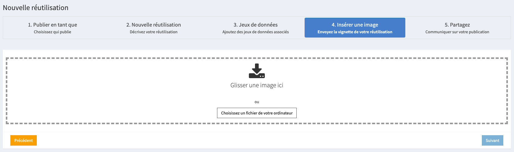

# Publier une réutilisation

## **Comment référencer une réutilisation ?**

Pour référencer une réutilisation :

1. [Connectez-vous à votre compte](https://www.data.gouv.fr/fr/login) data.gouv.fr  ;
2. Rendez-vous sur la page du jeu de données réutilisé ;
3. Naviguez jusqu’à la section **Réutilisations** qui figure en bas de la page et cliquez sur **Ajouter une réutilisation** ;

## **Définir qui publie la réutilisation**

Choisissez si vous souhaitez publier la réutilisation sous votre propre nom, à titre individuel, ou pour le compte d’une organisation, à titre collectif. C’est le nom qui apparaîtra à côté de la réutilisation sur la page du jeu de données.

### **Quand est-il conseillé de publier sous le nom de votre compte utilisateur ?**

Nous vous conseillons de publier une réutilisation sous le nom de votre compte utilisateur si elle n’a pas été produite dans le cadre des activités d’une organisation à laquelle vous êtes rattaché.

### **Quand est-il conseillé de publier au nom d’une organisation ?**

Nous vous conseillons de publier une réutilisation au nom d’une organisation s’il a été produit ou reçu dans le cadre des activités de cette organisation. Toutes les réutilisations peuvent être éditées par les membres de l’organisation.

## **Décrire la réutilisation**

Afin de présenter la réutilisation aux utilisateurs de data.gouv.fr, il est nécessaire de la décrire. Cette étape est cruciale pour que vos réutilisations soient bien référencées et que les utilisateurs et producteurs de données saisissent son importance. 

Lors de la création de la page de votre réutilisation, vous avez la possibilité de renseigner les informations suivantes :

| Information                                                                                                                         |   Description de l'information                                                                                                                         |
| ------------------------------------------------------------------------------------------------------------------------------------| -----------------------------------------------------------------------------------------------------------------------------------------------------------------------------------------------------------------------------------------------------------------------------------------------------------------------------------------------------------------------------------------------------------------------------------------------------------------------------------------------------------------------------------------------------------------------------------------------------------------------------------------------------------------------------------------------------------------------------------------| 
| Titre*|C’est le titre de la réutilisation. Précisez quelle forme prend la réutilisation : carte, graphique, tableau, etc. Préférez un titre qui permet de comprendre l’usage qui est fait des données plutôt que le nom du site ou de l’application. Par exemple, « Moteur de recherche des accords d’entreprises » ou « Cartographie des musées d’art moderne » sont des noms plus parlants que : « Accords-entreprise.fr » ou « Mon musée » par exemple. 
|URL*| Saisissez le lien hypertexte de la page web sur laquelle la réutilisation est visible. 
|Type*| Indiquez le type dans lequel ranger la réutilisation. Plusieurs types sont proposés (API, application, article de presse, visualisation etc.). 
|Description*| La description de votre réutilisation permet aux personnes qui la consultent d’obtenir des informations sur le contenu et le contexte de production de la réutilisation etc. C’est généralement la première chose que les utilisateurs lisent quand ils découvrent votre réutilisation.
| Mots clés| Les mots clés caractérisent votre réutilisation. Ils apparaissent sur la page de présentation et apportent un meilleur référencement lors d’une recherche utilisateur. L’apposition d’un mot clé permet également de classer votre réutilisation dans des thématiques. À partir de chaque mot clé, vous pouvez obtenir la liste des réutilisations pour lesquelles le mot clé a également été assigné.
| Mode privé| L’activation du mode privé permet de ne pas mettre en ligne la réutilisation. Cela laisse la possibilité de l’éditer avant sa publication. 

**Il est obligatoire de renseigner ces informations.*

## Recommandations sur la description de la réutilisation

Pour bien décrire votre réutilisation, nous vous conseillons de saisir des précisions sur : 

- **La méthode de création de la réutilisation : ** il est particulièrement intéressant de décrire comment vous avez réutilisé les données : quels outils avez-vous utilisés ? Avez-vous dû nettoyer les données au préalable ? Les avez-vous croisées avec d’autres sources ? Quels freins avez-vous rencontrés dans l’exploitation des données ? Quelles données aurait pu vous aider à améliorer votre réutilisation ? Ces informations permettent notamment aux producteurs des données de mieux comprendre les usages et d’en améliorer la qualité.
- **Ce que la réutilisation permet de faire ou de montrer : ** à ****quoi sert votre réutilisation ? Quelles conclusions peut-on tirer de vos travaux ?
- **L’auteur de la réutilisation : ** Il est intéressant d’expliciter ce qui vous a donné envie de réutiliser les données. Décrivez vous, ou votre organisation brièvement. Êtes-vous un journaliste, une entreprise, une association, une administration ? Il est préférable de garder un ton neutre sur la réutilisation et son auteur. En effet, si la réutilisation ressemble trop à un message promotionnel par exemple il est possible que nous la supprimions.

## **Associer des jeux de données à la réutilisation**

Par défaut, votre réutilisation sera liée au jeu de données qui vous a servi de point de départ. Mais si votre réutilisation a exploité d’autres jeux de données, vous pouvez les associer à votre réutilisation à cette étape.

Il est important d’associer tous les jeux de données utilisés, car cela permet de comprendre les croisements qui ont été nécessaires ainsi que d’améliorer la visibilité de votre réutilisation.

Pour lier d’autres jeux de données à votre réutilisation :

1. Saisissez leurs titres dans le champ ***Trouver votre jeu de données*** ;
2. Cliquez sur leur nom quand ils apparaissent à l’écran.

## **Insérer une image**

Si votre réutilisation prend la forme d’une représentation graphique, vous pouvez en donner un aperçu aux autres utilisateurs au moyen d’une image ou d’une capture d’écran. Cette image figurera dans la partie ***Réutilisations*** de la page du jeu de donnée associé.

Lorsque c’est pertinent, les captures d’écrans permettent de mieux rendre compte de ce qu’est la réutilisation, elles sont donc préférables aux logos ou aux illustrations par exemple.

Pour ajouter une image à votre réutilisation, cliquez sur le bouton ***Choisissez un fichier de votre ordinateur*** puis cliquez sur ***Suivant***.

**Votre réutilisation est en ligne. Elle est visible sur la page du jeu de données qui lui a servi de base.** Vous pouvez :

- voir la réutilisation sur le site, en cliquant sur ***Voir sur le site*** ;
- modifier la réutilisation depuis votre interface administrateur, en cliquant sur ***Voir dans l’administration***.

Nous mettons tous les mois en avant nos réutilisations préférées dans [un article](https://www.data.gouv.fr/fr/posts/) ainsi que sur les [réseaux sociaux](https://twitter.com/datagouvfr), n’hésitez pas à y faire un tour pour voir si vous y figurez !
